# Customer Support RAG Application Flowcharts

This document shows an end-to-end Retrieval-Augmented Generation (RAG) flow for a
customer support application used by both customers and customer service agents.

# Author - Abhinav Kanduri

- Linkedin : https://www.linkedin.com/in/abhinav-kanduri-a943b9353/
This project is only for learning purpose and understand the latest concepts such as LLM, RAG AI Agentic frameworks, PROMPT ENGINEERING WORKS, CONTEXT MANAGEMENT.

## Problem Statement

A company wants to build a customer support assistant that can answer questions
from product manuals, FAQs, troubleshooting guides, policy documents, support
tickets, and internal knowledge-base articles.

The application has two main users:

1. Customers, who ask questions and receive quick self-service answers.
2. Customer service agents, who use retrieved context and generated suggestions
   to resolve tickets faster.

The goal is to provide accurate, grounded, source-backed answers while reducing
manual lookup time for support teams.

## High-Level RAG System Flow

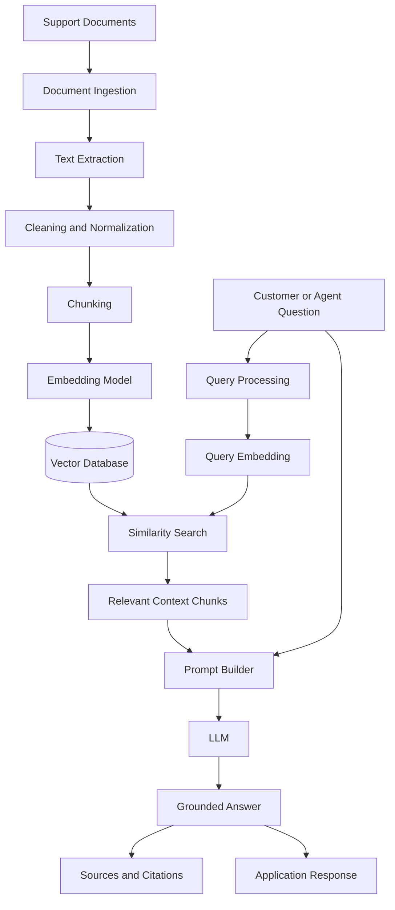

## Customer Self-Service Flow

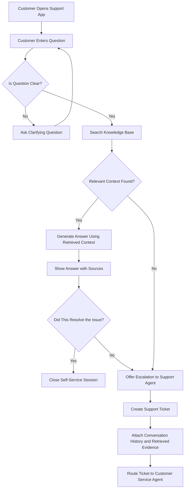

## Customer Service Agent Flow

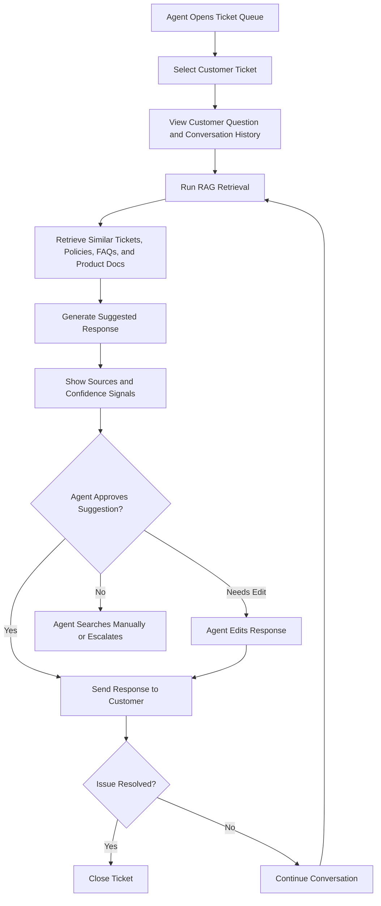

## End-to-End Customer Support RAG Workflow

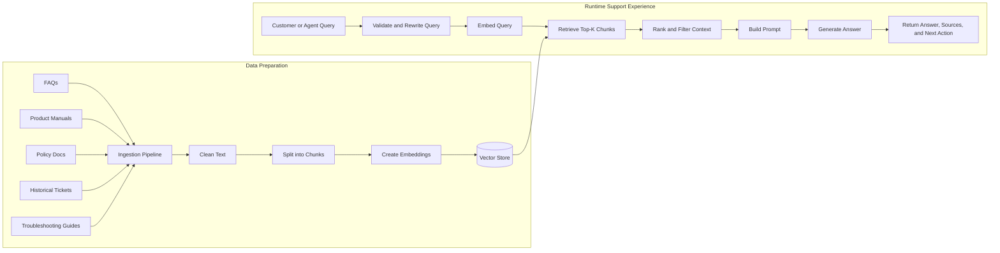

## Application Architecture Flow

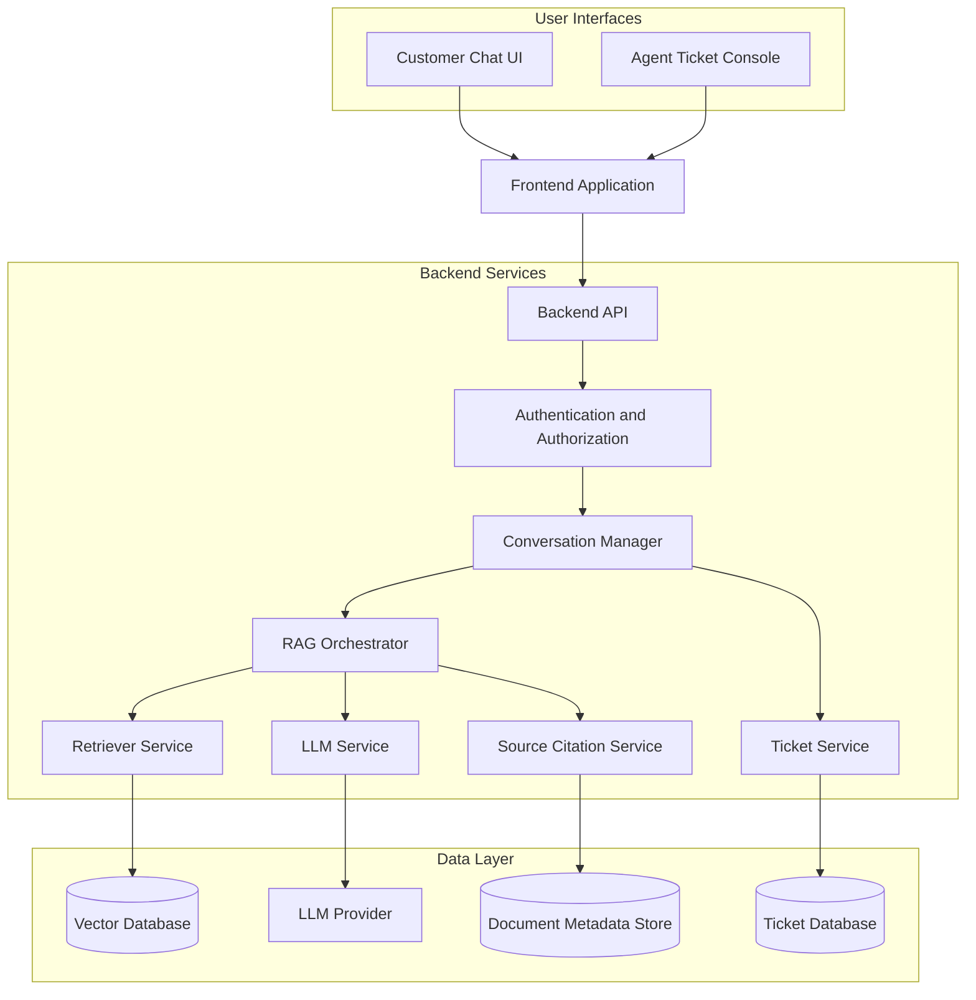

## Knowledge Base Ingestion Flow

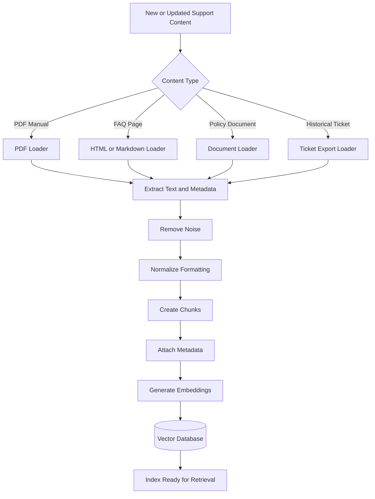

## Runtime Question Answering Flow

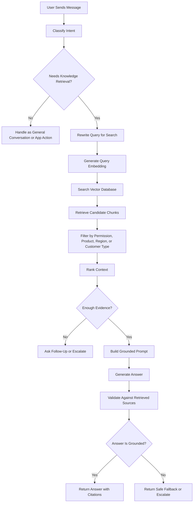

## Escalation Flow

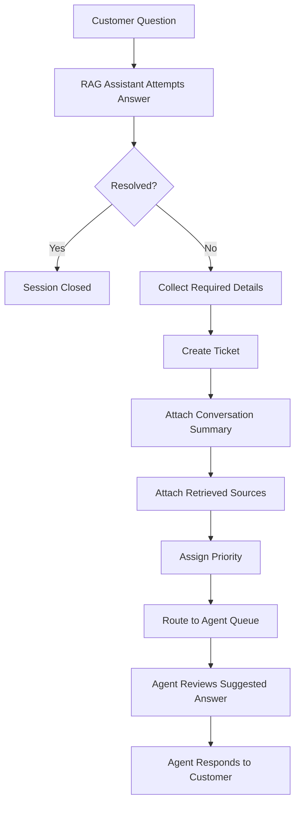

## Feedback and Continuous Improvement Flow

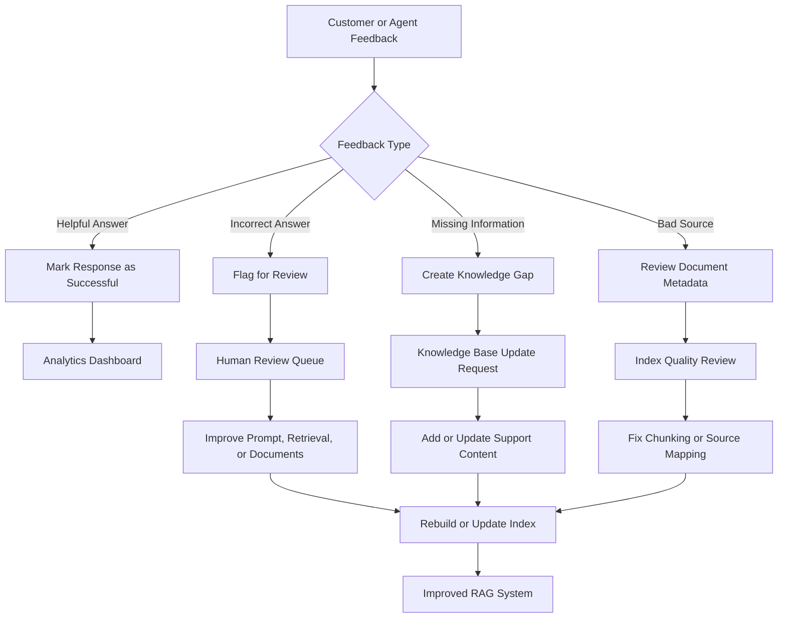

## Support Ticket Lifecycle with RAG

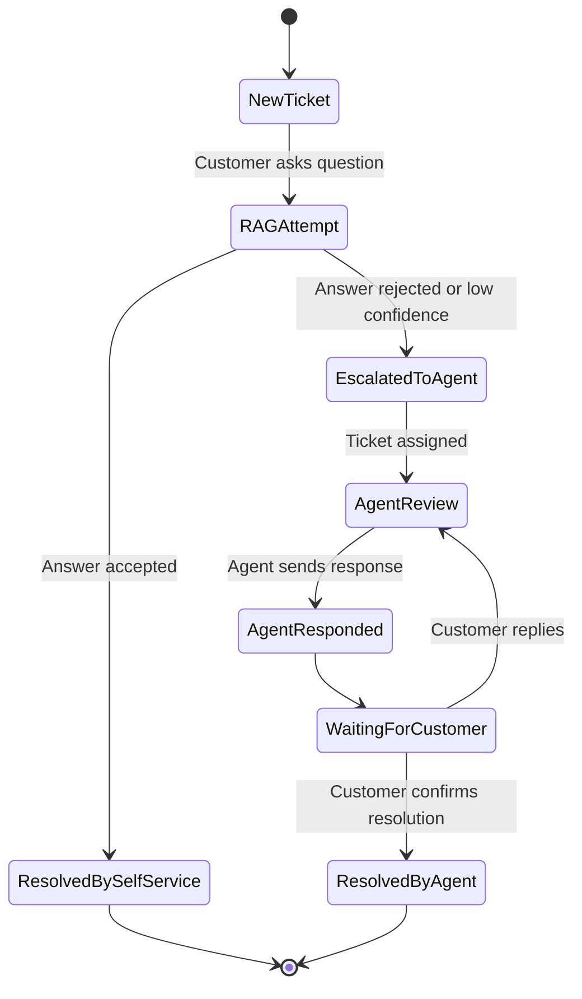

## Main Components

| Component | Purpose |
| --- | --- |
| Customer Chat UI | Allows customers to ask questions and receive self-service support. |
| Agent Console | Helps support agents review tickets, sources, and suggested responses. |
| Ingestion Pipeline | Loads, cleans, chunks, and embeds support documents. |
| Vector Database | Stores document embeddings for semantic search. |
| Retriever | Finds the most relevant support content for a question. |
| Prompt Builder | Combines the user question with retrieved context. |
| LLM | Generates a natural-language response from the grounded prompt. |
| Citation Service | Shows which documents were used to answer the question. |
| Ticket Service | Creates and manages escalated support tickets. |
| Feedback Loop | Captures quality signals to improve the system over time. |

## Key Design Rules

- Customers should receive simple, direct answers with visible sources when
  useful.
- Agents should receive richer context, similar tickets, policy notes, and a
  draft response they can edit.
- The system should not answer beyond the retrieved knowledge base when the
  question requires company-specific facts.
- Low-confidence or missing-context cases should escalate to a human agent.
- Every generated answer should be traceable to source documents or ticket
  history.

## Example User Journey

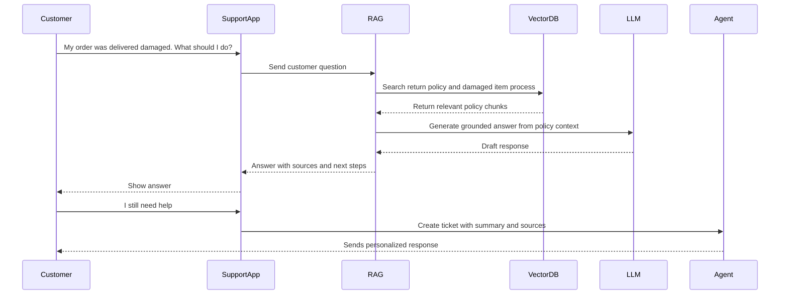

## Success Metrics

- Self-service resolution rate
- Average ticket handling time
- Retrieval relevance score
- Answer faithfulness score
- Escalation rate
- Customer satisfaction score
- Agent edit rate for generated drafts
- Number of identified knowledge gaps

## Suggested Build Order

1. Build document ingestion for FAQs and support articles.
2. Add chunking, embeddings, and vector storage.
3. Build a simple customer chat interface.
4. Add source-backed answer generation.
5. Add escalation to a support ticket.
6. Build the agent console view.
7. Add feedback collection.
8. Add evaluation and monitoring.
9. Improve retrieval with filters, reranking, and better metadata.
