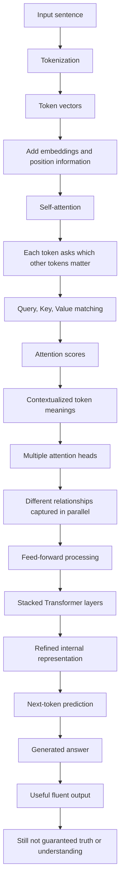

# Big Picture: What a Transformer Is Really Doing

## A Student-Friendly Walkthrough With One Example

This note explains how a Transformer works using one concrete sentence.

The goal is not to memorize math. The goal is to build the right intuition.

---

## The Example We Will Use

Sentence:

```text
The animal didn't cross the street because it was tired.
```

Question:

> What does "it" refer to?

Possible answers:

- The animal
- The street

A traditional model may struggle here because it has to connect words that are far apart and understand the relationship between them.

A Transformer is designed exactly for this kind of problem.

---

## Big Picture: What a Transformer Is Really Doing

A Transformer does not read text like a human.

Instead, it:

1. Looks at all words at once
2. Figures out which words matter to which other words
3. Builds a context-aware meaning for every word

The key idea behind this is **self-attention**.

Self-attention lets each word ask:

> Which other words should I pay attention to in order to understand myself?

---

## Step 1: Tokenization

Tokenization breaks text into smaller pieces called tokens.

The sentence:

```text
The animal didn't cross the street because it was tired.
```

may become:

```text
[The] [animal] [didn] ['t] [cross] [the] [street] [because] [it] [was] [tired] [.]
```

Each token becomes a vector, which is a list of numbers.

At this stage, the model does not know meaning yet. It only has pieces of text converted into numerical form.

---

## Step 2: Embeddings and Position Information

Each token receives two kinds of information:

- A word embedding, which represents roughly what the token means
- A position embedding, which represents where the token appears in the sentence

This is important because Transformers do not naturally process text in order the way humans read left to right.

The model needs to know both:

- What the token is
- Where the token appears

For example, the word `animal` and the word `street` have different meanings, and their positions also matter for understanding the sentence.

---

## Step 3: Self-Attention

Self-attention is the heart of the Transformer.

For each token, the model asks:

> Which other tokens should I look at to understand this token?

For the word `it`, the model looks at all the other tokens:

```text
The animal didn't cross the street because it was tired.
```

The model may learn that `it` is strongly connected to:

| Other Token | Attention Strength |
|---|---|
| animal | High |
| tired | High |
| because | Medium |
| street | Low |

So the model learns:

> The meaning of `it` is strongly connected to `animal` and `tired`.

This is how reference resolution happens.

---

## Step 4: Query, Key, and Value

Inside self-attention, each token creates three internal representations:

- **Query**: what this token is looking for
- **Key**: what this token offers as a label
- **Value**: the information this token carries

An intuitive way to think about it:

> Does my question match your label? If yes, give me your information.

For the token `it`:

- Query: What noun or idea does this pronoun refer to?
- Key from `animal`: I am a possible subject
- Value from `animal`: I represent the entity that may be tired

There are no hand-written grammar rules here.

The model learns these relationships from data.

---

## Step 5: Contextualized Word Meaning

After attention, each token vector is updated.

This means each word is no longer represented in isolation.

The meaning of each word now includes context from the surrounding sentence.

For example:

- `street` knows it is part of the phrase `cross the street`
- `because` knows it introduces a reason
- `tired` knows it describes a state
- `it` knows it likely refers to `animal`

This is one of the biggest differences between older language models and Transformers.

Transformers build context-aware meaning.

---

## Step 6: Multiple Attention Heads

Transformers do not run attention only once.

They run many attention patterns in parallel.

These are called **attention heads**.

Different heads can focus on different relationships:

- Grammar
- Cause and effect
- Coreference, such as `it` pointing to `animal`
- Temporal flow
- Subject-object relationships
- Nearby word relationships

This is why Transformers are powerful.

They can look at language from multiple perspectives at the same time.

---

## Step 7: Feed-Forward Layers

After attention, each token passes through a small neural network called a feed-forward layer.

This step further processes the representation.

An intuitive way to think about it:

> Now that I understand the context, let me refine the meaning.

The feed-forward layer helps transform the attention result into a richer internal representation.

---

## Step 8: Stacking Layers

A Transformer repeats the attention and feed-forward process many times.

For example:

- A smaller model may have 12 layers
- A larger model may have dozens or even hundreds of layers

Each layer refines the representation.

Early layers may capture simpler patterns such as grammar.

Middle layers may capture semantic relationships.

Later layers may capture task-specific and prediction-relevant patterns.

This repeated processing creates depth.

---

## Step 9: Output and Next-Token Prediction

Finally, the Transformer answers the core question:

> Given everything I now understand, what token comes next?

This is how:

- Text is generated
- Answers are produced
- Explanations are written
- Code is completed

Even after all the internal processing, the final output is still based on next-token prediction.

---

## End-to-End Transformer Flowchart



---

## Why Transformers Were a Breakthrough

Before Transformers, many models processed text sequentially.

That created problems:

- Long-range dependencies broke
- Distant words were hard to connect
- Important context faded
- Models were slower to train

Transformers changed this by allowing models to:

- See the full context at once
- Decide which words matter dynamically
- Connect distant ideas
- Build context-aware word meanings
- Train efficiently at large scale

This is why Transformers became the foundation of modern LLMs.

---

## But Here Is the Critical Limitation

Even with all this power, Transformers do not understand truth the way humans do.

They:

- Do not verify facts by default
- Do not reason symbolically like formal logic systems
- Do not know certainty in a reliable human sense
- Still predict tokens rather than check reality

They are extremely strong at manipulating patterns in language.

They are not guaranteed to understand the world those words describe.

That is why:

- Hallucinations happen
- Context limits matter
- RAG becomes necessary
- Evaluation and verification remain essential

---

## One-Line Student Summary

A Transformer understands a word by looking at all other words and deciding which ones matter most, using attention.

If you want the shortest explanation:

> A Transformer turns text into numbers, lets every token look at every other token, builds context-aware meaning, and then predicts the next token.

That is powerful.

But it is still not the same as truth, reasoning, or real-world understanding.
