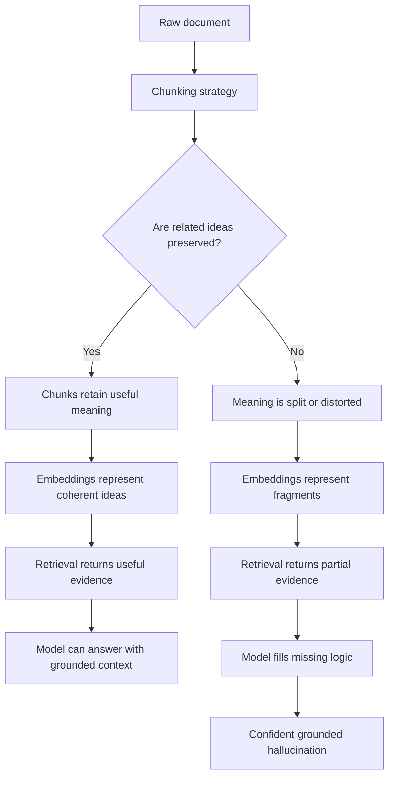

# Chunking Strategies

## Why How You Split Text Decides Whether RAG Works or Fails

By now, students often believe:

> If retrieval is correct and the model is strong, RAG should work.

This is false.

One of the most fragile points in a RAG system is chunking. Not embeddings. Not retrieval. Not the LLM.

Chunking is where meaning is either preserved or destroyed.

Once meaning is broken, no later stage can fully recover it.

This is why many real-world RAG systems fail before generation even begins.

---

## Problem Statement: Where RAG Really Breaks

RAG depends on retrieving useful evidence. But retrieval does not search whole books, manuals, policies, or knowledge bases as complete reasoning objects.

It usually searches small document pieces called chunks.

That means the system must decide:

- Where one chunk starts
- Where one chunk ends
- How much context belongs inside each chunk
- Whether related ideas should stay together
- Whether repeated context is worth the cost

This decision quietly controls what the model is allowed to understand.

If a chunk contains the wrong slice of text, retrieval may still look successful while the model receives incomplete evidence.

---

## Why Chunking Exists

Chunking is not optional. It is a structural requirement of RAG.

Engineers split documents because of three unavoidable constraints:

1. Full documents are often too large for context windows
2. Attention cost is expensive and grows quickly
3. Retrieval needs searchable units smaller than entire documents

So documents are split into smaller units before embedding, indexing, retrieval, and generation.

The important realization:

> RAG does not retrieve documents first. It usually retrieves chunks.

That means chunk quality becomes system quality.

---

## The Core Trade-Off of Chunking

Chunking always balances two opposing goals:

| Chunk Type | Strength | Weakness |
|---|---|---|
| Smaller chunks | Better retrieval precision | Worse reasoning continuity |
| Larger chunks | Better reasoning continuity | Lower retrieval precision and higher context cost |

You cannot maximize both at the same time.

This trade-off is the root of many RAG failures.

Small chunks can retrieve the exact sentence but miss the surrounding logic. Large chunks preserve more context but may bury the relevant fact inside noise.

---

## 1. Fixed-Size Chunking

Fixed-size chunking splits text into chunks of a fixed length.

Examples:

- 300 tokens per chunk
- 500 tokens per chunk
- 1,000 characters per chunk

The system does not understand sentences, paragraphs, headings, or meaning. It only counts length.

### Why This Exists

Fixed-size chunking solves early engineering problems:

- It is easy to implement
- It creates predictable chunk sizes
- It simplifies indexing and retrieval
- It works reasonably well for simple documents

This is why many RAG systems start here.

### What It Breaks

Fixed-size chunking can split:

- Sentences from their explanations
- Definitions from examples
- Assumptions from conclusions
- Steps from the process they belong to
- Exceptions from the rule they modify

The model does not retrieve ideas. It retrieves fragments.

The failure is simple:

> Fixed-size chunking is operationally convenient, but meaning is not fixed-size.

---

## 2. Overlap Chunking

Overlap chunking keeps part of the previous chunk inside the next chunk.

Example:

- Chunk size: 500 tokens
- Overlap: 100 tokens
- Chunk 2 starts before Chunk 1 fully ends

This means boundary information appears in more than one chunk.

### Why Overlap Was Introduced

Fixed-size chunking created sharp boundaries. Important context was often split across two chunks.

Overlap reduces this boundary loss by duplicating nearby text.

It helps when:

- A sentence crosses a boundary
- A definition appears just before an example
- A transition connects two paragraphs
- A short dependency spans adjacent chunks

### New Problems Introduced

Overlap does not remove the trade-off. It changes the failure mode.

Overlap can cause:

- Redundant chunks
- Wasted context window space
- Repetitive retrieved evidence
- Less room for new information
- Similar chunks competing with each other during retrieval

The key lesson:

> Overlap trades context loss for context noise.

---

## 3. Semantic Chunking

Semantic chunking splits text based on meaning rather than raw length.

It may use:

- Topic changes
- Sentence similarity
- Embedding distance
- Paragraph coherence
- Natural language boundaries

The goal is to keep related content together.

### Why Semantic Chunking Exists

Fixed-size chunking ignores meaning.

Semantic chunking tries to preserve local coherence by asking:

- Which sentences belong together?
- Where does the topic shift?
- Where does one idea end and another begin?

This often feels like the correct approach because it aligns chunk boundaries with meaning.

### What It Still Breaks

Semantic boundaries are not always reasoning boundaries.

A document can discuss one concept locally while the full argument depends on a later section.

Semantic chunking may still split:

- Definitions from later references
- Conditions from exceptions
- Evidence from conclusions
- Multi-step reasoning chains
- Long arguments across sections

The key lesson:

> Semantic chunking preserves local meaning, not global logic.

---

## 4. Document-Structure-Aware Chunking

Document-structure-aware chunking follows the structure created by the author.

It uses elements such as:

- Headings
- Sections
- Paragraphs
- Tables
- Lists
- Code blocks
- Captions

Instead of treating a document as flat text, it respects the document's hierarchy.

### Why This Exists

Flat text chunking destroys structure.

Structure-aware chunking preserves:

- Human-authored organization
- Section-level meaning
- Relationships between headings and paragraphs
- Table and list boundaries
- Documentation hierarchy

This works well for:

- Policies
- Manuals
- Technical documentation
- Product guides
- Legal or compliance documents

### New Problems Introduced

Document structure is not always retrieval-ready.

Sections may be too large. Subsections may depend on previous sections. Tables may need surrounding explanation. A heading may be necessary context for every paragraph beneath it.

Structure-aware chunking can still ignore:

- Cross-section dependencies
- Long-range reasoning
- Repeated references
- Definitions introduced earlier
- Conclusions that depend on multiple sections

The key lesson:

> Structure-aware does not automatically mean reasoning-aware.

---

## 5. Sliding Window Chunking

Sliding window chunking moves a fixed-size window through the document with overlap.

It is similar to overlap chunking, but the emphasis is on moving through text sequentially in small steps.

Example:

- Window size: 400 tokens
- Step size: 100 tokens
- Each new chunk shifts forward by 100 tokens

This creates many overlapping views of the same document.

### Why This Exists

Sliding windows help when meaning flows gradually across text.

They are useful for:

- Narrative documents
- Transcripts
- Long explanations
- Sequential procedures
- Documents where boundaries are hard to detect

### What It Breaks

Sliding windows can create a large number of similar chunks.

This increases:

- Index size
- Embedding cost
- Retrieval redundancy
- Context repetition
- Ranking confusion

The key lesson:

> Sliding windows reduce boundary risk, but they increase redundancy and cost.

---

## 6. Hierarchical Chunking

Hierarchical chunking stores documents at multiple levels of granularity.

For example:

- Document
- Section
- Paragraph
- Sentence

A system may retrieve a small child chunk first, then include the larger parent section for context.

This is often called parent-child retrieval.

### Why This Exists

A small chunk may be best for matching a query, but a larger chunk may be best for answering the query.

Hierarchical chunking separates:

- Retrieval precision
- Answer context

The system can search narrowly, then expand context intelligently.

### What It Breaks

Hierarchical chunking is more powerful, but also more complex.

It requires careful decisions about:

- Parent-child relationships
- How much parent context to include
- Whether multiple child chunks share the same parent
- How to avoid adding too much irrelevant context
- How to tune retrieval and expansion together

The key lesson:

> Hierarchical chunking is often better for reasoning, but harder to design and tune.

---

## 7. Query-Aware Chunking

Query-aware chunking adapts chunk selection or chunk formation based on the user's query.

Instead of assuming one fixed chunking strategy works for every question, the system considers query intent.

For example:

- A factual lookup may need a small chunk
- A policy question may need a full section
- A comparison question may need multiple related chunks
- A procedural question may need a sequence of steps

### Why This Exists

Different questions require different context shapes.

The same document may need to be retrieved differently depending on whether the user asks for:

- A definition
- A rule
- An exception
- A process
- A comparison
- A summary

Query-aware chunking tries to align retrieved context with the reasoning task.

### What It Breaks

Query-aware chunking is difficult to generalize.

It can introduce:

- More system complexity
- Higher latency
- Query classification errors
- Harder evaluation
- More tuning work

The key lesson:

> Query-aware chunking is powerful because it matches the task, but fragile because query intent is hard to infer reliably.

---

## Why Chunk Size Breaks Reasoning

Most reasoning does not live inside a single chunk.

Examples:

- A definition appears on page 1, but exceptions appear on page 4
- A condition appears early, but the conclusion appears later
- A policy rule appears in one section, but eligibility criteria appear in another
- A technical concept is introduced first, then used many paragraphs later
- A multi-step argument spans several sections

In a RAG system:

1. A query retrieves a few chunks
2. Some supporting chunks are missing
3. The model receives partial logic
4. The model produces an answer from incomplete evidence

Even when retrieval looks correct, the answer can still be impossible to produce correctly.

The model is not failing because it is weak. It is failing because the evidence is incomplete.

---

## Cross-Chunk Dependency Loss

Cross-chunk dependency loss is one of the most dangerous RAG failures.

It happens when the reasoning chain is split across chunks:

| Chunk | Content |
|---|---|
| Chunk A | Assumptions |
| Chunk B | Logic |
| Chunk C | Conclusion |

If RAG retrieves only Chunk B or Chunk C, the model sees a partial argument.

### Why This Is Catastrophic

The model cannot reconstruct missing steps from evidence it never received.

So it may:

- Fill gaps with plausible assumptions
- Overgeneralize from a partial chunk
- Ignore missing exceptions
- Produce an answer that sounds grounded but is wrong

This creates grounded hallucinations:

> Errors that are partially supported by retrieved text.

These are dangerous because they look more trustworthy than unsupported hallucinations.

---

## The Causal Chain

Students should remember this chain:

```text
Chunking -> broken meaning
Broken meaning -> bad retrieval
Bad retrieval -> incomplete context
Incomplete context -> confident hallucinations
```

Chunking errors propagate and amplify downstream.

Once the document is split badly, embeddings encode partial meaning, retrieval returns partial evidence, and generation reasons from partial logic.

---

## Quick Reference: Chunking Strategies

| Strategy | Description | Strength | Risk |
|---|---|---|---|
| Fixed-size chunking | Split by token or character count | Simple and predictable | Breaks meaning and reasoning |
| Overlap chunking | Fixed-size chunks with shared boundary text | Reduces boundary loss | Adds redundancy and noise |
| Semantic chunking | Split based on meaning similarity | Preserves local coherence | Misses long-range logic |
| Document-structure-aware chunking | Split using headings, sections, paragraphs, tables, and lists | Preserves hierarchy | Ignores cross-section dependencies |
| Sliding window chunking | Move overlapping windows through text | Useful for narrative or sequential content | High redundancy and cost |
| Hierarchical chunking | Store chunks at multiple granularities | Supports parent-child retrieval | Complex to implement and tune |
| Query-aware chunking | Adapt context shape to query intent | Improves task relevance | Hard to generalize reliably |

---

## Chunking Failure Flowchart



---

## Closing Insight

Chunking decides what the model is allowed to understand.

Once that decision is wrong, everything else is damage control.

The transition to remember:

> Because chunking can break meaning, embeddings can become misleading. The next failure point is embeddings and semantic retrieval.
