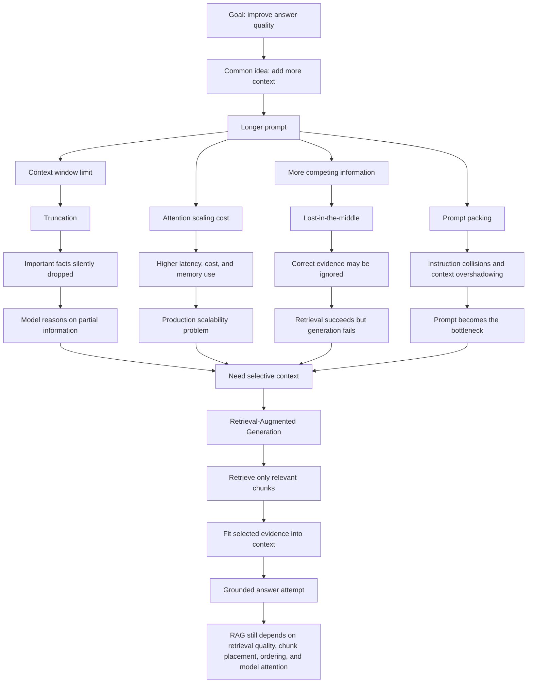

# Context Window & Attention Constraints

## Why Just Giving More Context Does Not Work

When students first learn about LLMs, they often assume:

> If the model is wrong, just give it more context.

This sounds reasonable because humans often make better decisions when they have more information.

But LLMs are not humans. More context does not automatically create more understanding. In many real systems, more context creates more confusion, more cost, and more ways for the model to miss the important detail.

The key truth:

> More context does not mean more intelligence.

To understand why, we need to look at how LLMs actually see information.

---

## 1. Context Window Limits

A context window is the maximum number of tokens an LLM can process at one time.

Anything outside that window is invisible to the model. It is not remembered. It is not considered. It does not exist during that generation step.

A context window is not long-term memory. It is more like a temporary working buffer.

### Why Context Windows Exist

Before attention-based models, language systems struggled with anything longer than a few sentences. They could not reliably connect ideas across paragraphs or maintain conversational continuity.

Context windows helped solve this by enabling:

- Multi-paragraph reasoning
- Conversational continuity
- Document-level question answering
- Longer prompts and richer instructions

This is one reason modern chatbots and document QA systems became possible.

### New Problem Created

The problem is that the window is still finite.

When the input is too large:

- Content beyond the window is ignored
- Important facts can be dropped
- The model does not know something was removed
- The answer is produced from partial information

So the model may appear to reason over the full problem while actually reasoning over an incomplete version of it.

---

## 2. Attention Scaling

Self-attention allows each token to compare itself with other tokens in the context.

This is powerful because it helps the model connect related information across a prompt.

But attention is expensive.

In simple terms:

```text
100 tokens -> 10,000 comparisons
10,000 tokens -> 100,000,000 comparisons
```

This grows roughly quadratically, often described as `O(n^2)`.

### What Attention Solved

Before attention, models struggled to connect distant parts of text.

Attention enabled:

- Contextual understanding
- Cross-sentence relationships
- Better long-form generation
- More coherent answers

It was a major breakthrough.

### New Problem Created

Long context becomes expensive in production.

It can increase:

- Latency
- GPU memory usage
- Inference cost
- Operational complexity

This means production systems cannot keep increasing context indefinitely. Practical limits always exist, even when model context windows become larger.

---

## 3. Token Truncation Effects

Token truncation happens when the prompt exceeds the model's context window and some tokens are removed.

This can happen silently.

The removed content may come from the beginning, middle, or another part of the assembled prompt, depending on the application logic and framework.

### Why This Is Dangerous

Truncation is usually not semantic.

It does not automatically know which facts are important. It does not preserve the best evidence. It does not understand which instruction or document chunk is critical.

As a result:

- Key assumptions disappear
- Retrieved evidence may be removed
- Reasoning chains break
- The model answers from missing premises

The worst part is that the model does not know something is missing.

It will still generate a fluent answer.

---

## 4. The Lost-in-the-Middle Problem

The lost-in-the-middle problem means that LLMs often pay more attention to information near the beginning and end of the prompt while underusing information in the middle.

This matters because a prompt can contain the correct answer and the model can still miss it.

### Why It Happens

This behavior can come from:

- Positional bias
- Attention patterns
- Training dynamics
- Prompt structure
- Competition between many tokens

### What It Reveals

In RAG systems, retrieval can succeed but generation can still fail.

The system may retrieve the right chunk. The answer may be present in the prompt. But if the model under-attends to that chunk, the final answer can still be wrong.

This is a core RAG failure mode:

> Retrieval succeeded, but reasoning over the retrieved context failed.

---

## 5. Long Context Is Not Better Reasoning

A common misconception is:

> If we increase the context window, reasoning will improve.

Sometimes a larger window helps. But longer context also introduces more noise.

Longer prompts can add:

- Irrelevant details
- Conflicting evidence
- Distracting examples
- Old conversation history
- Spurious correlations

The model does not have perfect structured memory. It does not automatically know which token matters most. Many tokens compete for attention at the same time.

As context grows, reasoning quality can degrade rather than improve.

More tokens can mean more confusion.

---

## 6. Prompt Packing Failures

Prompt packing is the practice of putting everything the model needs into one prompt.

A production prompt may include:

- System instructions
- Developer rules
- Retrieved chunks
- Conversation history
- Examples
- Output format constraints
- Tool results

### Why Prompt Packing Exists

Prompt packing solved an early problem:

> How do we guide model behavior without modifying the model?

The answer was:

> Put the instructions and context into the prompt.

This made LLM applications flexible and fast to build.

### New Problem Created

At scale, the prompt itself becomes the bottleneck.

Prompt packing can cause:

- Instruction collisions
- Context overshadowing
- Retrieved evidence drowned by noise
- Conflicting requirements
- Higher cost and latency
- More truncation risk

The prompt becomes crowded. The model may follow the wrong instruction, ignore the right evidence, or prioritize recent text over important text.

---

## 7. The Full Causal Chain

Students should remember this chain:

| Constraint | Immediate Effect | System Failure |
|---|---|---|
| Context window limits | Not everything fits | Important information is ignored |
| Attention scaling | Long prompts are expensive | Cost and latency increase |
| Token truncation | Content is silently removed | Reasoning happens on partial reality |
| Lost-in-the-middle | Middle content is underused | Correct evidence may be ignored |
| Prompt packing | Too many competing instructions and facts | Reasoning collapses under noise |

The core lesson:

> More tokens do not equal more intelligence.

---

## 8. End-to-End Flowchart



---

## 9. Why This Leads to RAG

RAG is introduced because full documents often do not fit into the prompt.

Even when they do fit, the model may not use them well.

RAG tries to solve this by retrieving only the most relevant chunks and placing them into the model's context. In theory, the model receives just what it needs instead of everything available.

This helps because:

- Full documents do not need to be passed every time
- Fresh information can be selected dynamically
- Context can be focused around the user question
- Cost can be reduced compared with sending everything

But RAG still breaks when:

- Retrieval returns the wrong chunks
- Chunking splits important meaning
- Ranking places the best evidence too low
- The prompt places evidence where the model under-attends to it
- Too much retrieved context creates noise
- The model ignores or misuses the evidence

RAG reduces damage. It does not eliminate the fundamental limits.

---

## Closing Insight

Context windows are a bandwidth limit, not memory.

RAG helps choose what fits, but it cannot automatically decide what matters.

The real engineering challenge is not just adding more context. It is selecting, ordering, compressing, and evaluating the right context so the model can use it reliably.
