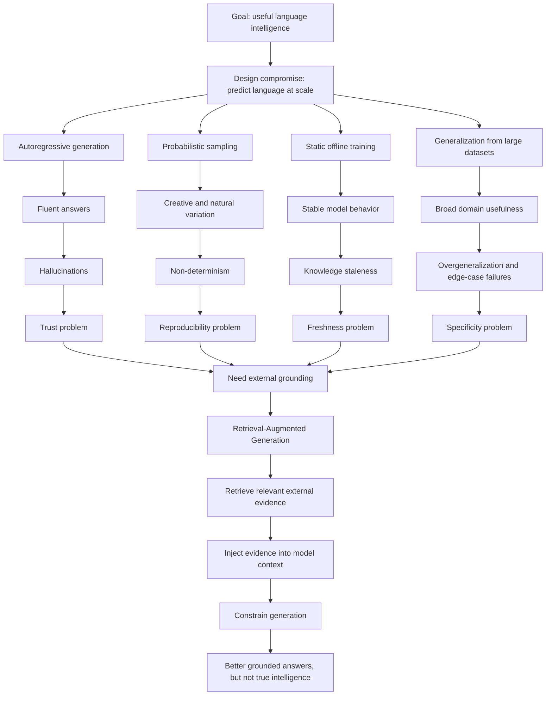

# Core Limitations of LLM Intelligence

## Why Better Prompts Do Not Fix Fundamental Failures

Once you understand how Large Language Models (LLMs) actually work, an important realization follows:

> LLM failures are not just bugs. They are consequences of the design choices that made LLMs possible.

This is critical for students to understand.

If hallucinations, inconsistency, or wrong answers are treated only as "model mistakes," the natural reaction is to keep trying to fix them with better prompts, stricter instructions, or longer system messages.

Those techniques can help. They can guide the model, reduce ambiguity, and improve answer format. But they cannot remove the core limitations because the limitations come from the architecture and training objective itself.

LLMs are powerful language engines. They are not truth engines.

---

## 1. Hallucinations

A hallucination happens when an LLM generates information that is factually incorrect but presents it with fluent, confident language.

The dangerous part is not only that the model is wrong. The dangerous part is that it sounds sure.

Hallucinations are structural because the model is designed to continue generating text. It does not naturally stop, verify, or inspect reality before answering. The model has no built-in truth state where it can reliably say, "I do not know because I cannot verify this."

At each step, the model predicts the next likely token. If the answer is not known, incomplete, ambiguous, or missing from the prompt, the model still tries to produce something that fits the language pattern.

That means hallucination is not just a random accident. It is a predictable failure mode of a system optimized to produce fluent continuations.

### Why This Trade-Off Exists

Before modern LLMs, systems that refused to answer often felt useless. Silent failures looked like broken software. Users expected the system to respond, even when the question was difficult.

So a major practical trade-off emerged:

> Always produce a helpful-looking answer, even if certainty is limited.

This made LLMs conversational, useful, and easy to interact with. But it also made them unsafe in situations where correctness matters more than fluency.

### New Problem Created

Hallucinations create confident misinformation. Errors become hard to detect because the writing style looks polished and authoritative.

This becomes especially risky in enterprise, legal, medical, financial, and safety-sensitive systems where a fluent wrong answer can cause real damage.

This is one of the biggest reasons RAG exists.

---

## 2. Non-Determinism

Non-determinism means the same input can produce different outputs across runs.

Ask the same question twice and the model may answer in two different ways. Sometimes the difference is harmless. Sometimes it changes the conclusion, the wording, the cited details, or the recommended action.

This happens because LLM generation is probabilistic. The model does not simply decide one fixed answer. It samples from possible next tokens. Even when randomness is reduced, small numerical differences, floating-point behavior, and distributed inference across machines can introduce variation.

The key idea is:

> The model samples. It does not decide in the way a deterministic program does.

### Why This Trade-Off Exists

Earlier deterministic language systems were often repetitive, robotic, and brittle. They produced the same style of answer again and again.

Non-determinism made LLMs feel more natural. It introduced variation, creativity, flexible wording, and human-like conversation.

This is part of why LLMs feel intelligent.

### New Problem Created

Production systems often need repeatability, traceability, and auditability.

Non-determinism makes debugging harder because a failure may not reproduce exactly. It also makes certification, testing, and compliance more difficult because the system may not produce the same answer every time.

RAG does not fully fix non-determinism. It can reduce randomness by constraining the context, but the generation step is still probabilistic unless the system is carefully controlled.

---

## 3. Knowledge Staleness

LLMs do not automatically know new information after training. Once a model is trained and deployed, its internal knowledge is mostly frozen.

A model may not know about:

- New company policies
- Recent product changes
- Updated prices
- New laws or regulations
- Current medical guidance
- Recent events

This happens because training is expensive, offline, and periodic. Updating an LLM is not like updating a database row. The model's knowledge is stored statistically across weights, not explicitly as clean records.

### Why This Trade-Off Exists

Static training gives the model stable behavior. It reduces the risk of unstable online learning, where the model changes constantly and may forget previous knowledge or absorb bad data.

Static training enabled massive pretraining at scale. It made foundation models practical.

### New Problem Created

The model can give outdated answers while sounding completely current.

It may suggest old procedures, old prices, old policies, or outdated legal and medical information. The user may not realize the model is operating from stale knowledge because the answer still sounds fluent.

This directly motivates RAG.

RAG allows the system to retrieve fresh external information without retraining the model.

---

## 4. Overgeneralization Failures

Overgeneralization happens when an LLM applies a broad pattern to a specific case where that pattern does not actually fit.

The model has learned what usually works. But real-world systems often depend on exceptions, edge cases, local rules, domain-specific policies, and small details that change the correct answer.

The model prefers:

> What usually sounds right.

But the system needs:

> What is correct in this exact case.

This failure happens because training rewards generalization. Edge cases are rare in data, and statistical learning smooths away many details.

### Why This Trade-Off Exists

Older rule-based systems failed because they did not generalize. They worked only when humans had explicitly written the correct rule.

LLMs solved this by learning flexible patterns from huge amounts of text. That flexibility allows them to work well enough across many domains.

### New Problem Created

The same flexibility creates errors when the task depends on exact constraints.

LLMs may fail on legal clauses, policy exceptions, tax rules, medical criteria, financial conditions, eligibility rules, and enterprise-specific workflows.

RAG can retrieve the relevant exception, but retrieval alone does not guarantee that the model will apply it correctly.

---

## 5. One Causal Chain Students Must Remember

The core limitations are easier to understand as trade-offs:

| Design Choice | Capability Created | Failure Introduced |
|---|---|---|
| Autoregressive generation | Fluent long-form answers | Hallucinations |
| Probabilistic sampling | Natural and creative responses | Non-determinism |
| Static training | Stable large-scale models | Knowledge staleness |
| Generalization | Broad usefulness across domains | Edge-case failures |

These are not random bugs. They are the cost of the design choices that make LLMs useful.

---

## 6. End-to-End Flowchart

---

## 7. Why This Leads to RAG

RAG is introduced because core LLM limitations create reliability gaps.

| Limitation | Why RAG Is Used |
|---|---|
| Hallucinations | Inject factual grounding |
| Knowledge staleness | Retrieve fresh information |
| Overgeneralization | Surface specific rules and exceptions |
| Non-determinism | Constrain the answer space with retrieved context |

The key warning is:

> RAG constrains the model. It does not fix intelligence.

RAG helps the model see more relevant information at answer time. It does not make the model truly understand that information.

---

## Closing Insight

LLMs are powerful because they generate language fluently across many domains.

They fail because fluency is not the same as truth, determinism, freshness, or case-specific reasoning.

RAG helps LLMs access external knowledge, but the system still needs retrieval quality, evaluation, guardrails, observability, and human judgment for high-stakes use cases.

RAG helps LLMs see more.

It does not make them understand more.
