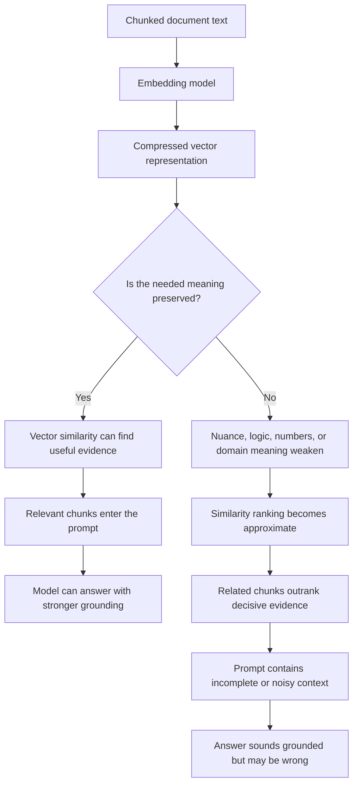

# Embeddings & Semantic Retrieval

## Why Semantic Similarity Is Not the Same as Relevance

After studying chunking, students often believe:

> If we chunk correctly, retrieval should work.

But a deeper truth appears here:

> Even good chunking does not guarantee correct retrieval.

The reason is simple but unintuitive:

> Embeddings do not store meaning. They compress meaning.

And compression always loses information.

This is where retrieval can silently drift away from correctness.

---

## Problem Statement: Why Retrieval Still Fails After Chunking

Chunking decides what text is available for retrieval.

Embeddings decide how that text is represented for retrieval.

That representation is not the original text. It is a numeric approximation of the text's meaning.

This creates a hidden failure point:

- The correct chunk may exist
- The document may be well chunked
- The model may be strong
- But retrieval may still miss the decisive evidence

Why?

Because semantic retrieval searches by vector similarity, not by truth, logic, or task relevance.

It finds text that looks related in embedding space.

RAG needs evidence that answers the question.

Those are not always the same thing.

---

## Why Embeddings Exist

Before embeddings, most search systems depended heavily on keywords.

Keyword search is useful, but it is brittle.

It fails when:

- Synonyms do not match
- Paraphrases use different wording
- User intent is implicit
- The document says the answer in a different vocabulary
- The query and answer share few exact terms

Example:

| Query phrase | Document phrase |
|---|---|
| Terminate employment | End contract |

These can refer to a similar idea, but keyword search may treat them as unrelated.

This made traditional search unreliable for natural language questions.

---

## The Breakthrough: Semantic Embeddings

Embeddings were introduced to move beyond exact word matching.

The core idea:

1. Convert text into numeric vectors
2. Put similar meanings near each other in vector space
3. Retrieve text by similarity instead of exact keyword overlap

This replaced lexical matching with semantic matching.

That was a major breakthrough.

Without embeddings, RAG would usually collapse back into brittle keyword search.

With embeddings, a system can retrieve relevant-looking content even when the wording differs.

---

## 1. What Vector Embeddings Are

An embedding is a fixed-length numeric vector that represents text.

Common embedding vectors may contain hundreds or thousands of dimensions.

For example:

- 384 dimensions
- 768 dimensions
- 1,536 dimensions
- 3,072 dimensions

The exact size depends on the embedding model.

The important idea is not the number of dimensions. The important idea is compression.

An embedding is:

- Not the original text
- Not a database record
- Not a perfect meaning object
- Not a reasoning trace

It is a lossy numeric summary.

The student-friendly version:

> An embedding is a compressed shadow of the text, not the text itself.

---

## What Embeddings Successfully Solve

Embeddings are powerful because they help retrieve content by meaning instead of exact words.

They can support:

- Paraphrase matching
- Synonym matching
- Cross-language similarity
- General semantic search
- Natural language queries over documents

Example:

| User Query | Relevant Text |
|---|---|
| Can I cancel my subscription? | Customers may terminate their plan at any time. |
| How do I reset access? | Password recovery is available from the account portal. |
| What happens if payment fails? | Accounts enter a grace period after billing failure. |

Keyword search might miss these. Embedding search is much more likely to find them.

This is why embeddings are central to RAG.

---

## The New Problem: Meaning Compression Loss

Embeddings solve one problem by introducing another.

The trade-off looks like this:

```text
Long text -> single vector
Multiple ideas -> compressed representation
Compressed representation -> lost nuance
```

When meaning is compressed:

- Nuance weakens
- Logical structure weakens
- Order weakens
- Causality weakens
- Negation can blur
- Exceptions can disappear
- Numerical relationships can become unreliable

This loss is irreversible.

Once a chunk is compressed into a vector, the retrieval system cannot fully reconstruct the original meaning from that vector alone.

The original text still exists in storage, but retrieval ranking is based on the compressed representation.

That is the dangerous part.

---

## 2. Meaning Compression Loss

Consider these two sentences:

| Sentence | Meaning |
|---|---|
| Feature X is allowed except when approval is missing. | Feature X is conditionally allowed. |
| Feature X is allowed when approval is missing. | Feature X is allowed in the exception case. |

These sentences share many words, but their meanings differ sharply.

The difference depends on:

- Negation
- Conditions
- Exceptions
- Logical structure

Embedding models can sometimes place these sentences close together because much of the surface meaning overlaps.

This creates a retrieval problem:

- The text looks semantically similar
- The constraint is easy to blur
- The wrong chunk may rank highly
- The model may reason from the wrong condition

The key lesson:

> Retrieval becomes approximate truth, not exact truth.

---

## 3. Domain-Specific Vocabulary Problems

Many embedding models are trained for broad, general-purpose language.

That works well for common concepts.

It can break in specialized domains.

Examples:

- Legal clauses
- Medical abbreviations
- Financial codes
- Insurance policy terms
- Internal company jargon
- Product-specific terminology
- Engineering incident language

Specialized terms may:

- Appear rarely in training
- Have weak representations
- Cluster near the wrong concepts
- Fail to match internal synonyms
- Lose important domain-specific nuance

Result:

1. The correct document exists
2. The correct chunk exists
3. The embedding similarity is too low
4. Retrieval never returns the answer

This is a silent failure.

The system does not know it missed the answer. It simply returns something else.

---

## 4. Numerical and Tabular Data Failures

Embeddings often struggle with numbers, tables, and quantitative relationships.

Example:

| Sentence | Meaning |
|---|---|
| Revenue increased from 5% to 7%. | Revenue went up. |
| Revenue increased from 7% to 5%. | The wording says increased, but the numbers show a decrease. |

The language is similar, but the quantitative meaning is different.

Embeddings may treat these as close because they share:

- Similar words
- Similar structure
- Similar topic
- Similar numbers

But for analysis, the difference matters.

This causes failures such as:

- Wrong trends retrieved
- Incorrect comparisons
- Broken quantitative reasoning
- Tables losing row and column structure
- Units and thresholds being ignored

The key lesson:

> Semantic similarity is not numerical correctness.

---

## 5. Query-Document Semantic Mismatch

Query-document semantic mismatch is one of the most common real-world retrieval failures.

It happens when the query and retrieved document are related but do not answer the same question.

Example:

| User Query | Retrieved Chunk | Problem |
|---|---|---|
| Is Feature X allowed? | Feature X overview | Related topic, not a decision rule |
| Can contractors access system Y? | Contractor onboarding guide | Related group, not access permission |
| What is the refund exception? | Refund policy summary | Related policy, missing exception |

Why this happens:

- Embeddings optimize for semantic closeness
- The query and document share topic words
- The retrieved chunk feels relevant
- But the chunk does not contain decisive evidence

The system retrieves related content instead of answer-bearing content.

The key lesson:

> RAG does not need related text. It needs decisive evidence.

---

## 6. High Recall, Low Precision

When teams notice retrieval misses answers, they often respond by retrieving more chunks.

The reasoning sounds sensible:

> Retrieve more context so the answer is more likely to be included.

This improves recall.

Recall means the right information is somewhere in the retrieved set.

But it often damages precision.

Precision means most retrieved information is actually useful.

The trade-off:

| Retrieval Choice | Benefit | Cost |
|---|---|---|
| Retrieve fewer chunks | Less noise | Higher chance of missing evidence |
| Retrieve more chunks | Higher chance of including evidence | More irrelevant context |

When too much is retrieved, the prompt may contain:

- A few useful chunks
- Many irrelevant chunks
- Repeated context
- Conflicting evidence
- Related but non-answering content

This causes:

- Distraction
- Evidence buried in noise
- Lost-in-the-middle effects
- Weaker grounding
- More opportunities for the model to choose the wrong evidence

Retrieval may technically succeed, but generation can still fail.

---

## Why Retrieval Starts Lying

Semantic retrieval does not literally lie.

But it can create outputs that feel more correct than they are.

It returns chunks that are:

- Topically related
- Lexically similar
- Semantically nearby
- Plausible as evidence

But they may not be:

- Complete
- Exact
- Decisive
- Current
- Numerically correct
- Logically aligned with the query

That is why retrieval can look good in a demo and fail in production.

The retrieved text feels relevant. The answer sounds grounded. But the evidence is not actually sufficient.

---

## The Core Causal Chain

Students should remember this chain:

```text
Embeddings compress meaning
Compression removes nuance
Retrieval becomes approximate
Approximate retrieval breaks reasoning
Semantic similarity is not semantic correctness
```

This is the moment where students should realize:

> Retrieval can look right and still be wrong.

---

## Quick Reference: Embedding and Retrieval Failures

| Failure Mode | What Happens | Result |
|---|---|---|
| Meaning compression loss | A chunk becomes a lossy vector | Nuance, logic, and constraints weaken |
| Negation and exception loss | Similar wording hides opposite meaning | Wrong rules or conditions retrieved |
| Domain vocabulary mismatch | Specialized language is poorly represented | Correct chunks rank too low |
| Numerical and table failure | Similar text hides different quantities | Quantitative answers become unreliable |
| Query-document mismatch | Related chunks do not answer the question | Retrieval returns plausible but weak evidence |
| High recall, low precision | More chunks are retrieved to avoid misses | Noise overwhelms useful context |

---

## Embedding Retrieval Failure Flowchart



---

## Why This Leads to the Next Failure

Because embeddings and retrieval are imperfect, systems often retrieve:

- Too little context
- Too much context
- The wrong context
- The right context in the wrong order
- Related text instead of decisive evidence

To compensate, teams introduce:

- Re-ranking models
- Hybrid search
- Metadata filters
- Query rewriting
- Retrieval heuristics
- More evaluation pipelines

These tools help, but they also add cost, latency, and new failure modes.

---

## Closing Insight

Embeddings are excellent at finding related text.

But RAG needs decisive evidence.

Those are not the same.

The transition to remember:

> Because semantic retrieval is approximate, the next failure layer is retrieval failure modes and re-ranking limits.
