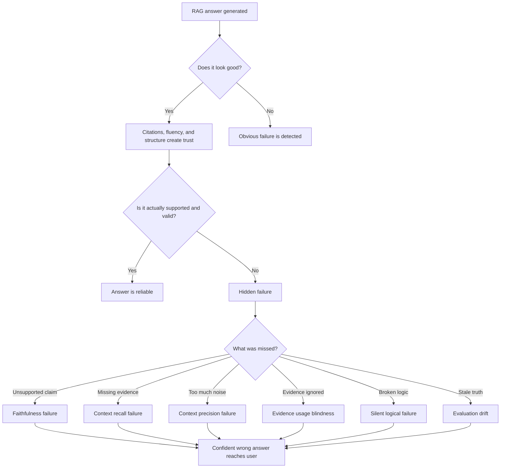

# Evaluation & Hidden Failures

## Why RAG Systems Fail Silently and Confidently

The most uncomfortable question in applied AI is:

> How do we know our RAG system is wrong?

Most teams assume that if answers look good, citations exist, and users seem satisfied, the system must be working.

That assumption is wrong.

The most dangerous RAG failures are not the obvious ones.

They are the failures that look correct, sound correct, include citations, and are still wrong.

---

## Problem Statement: Why Hidden Failures Matter

RAG systems are hard to evaluate because they fail behind fluent language.

The answer may be:

- Well written
- Confident
- Structured
- Cited
- Plausible
- Partially grounded

But it may still be:

- Unsupported
- Incomplete
- Logically invalid
- Based on the wrong evidence
- Missing important exceptions
- Answering from stale information

This makes RAG failures difficult to detect before users trust them.

The core problem:

> Good language can hide bad reasoning.

---

## Big Picture: Why Evaluation Is the Real Problem

Traditional evaluation often asks:

> Does the answer look right?

RAG evaluation must ask a harder question:

> Is the answer supported, complete, current, and logically valid?

That is a much higher standard.

RAG evaluation must inspect multiple layers:

- Retrieval quality
- Context relevance
- Evidence completeness
- Citation support
- Faithfulness
- Logical validity
- Answer consistency
- Knowledge freshness

This is why RAG evaluation is not just model evaluation.

It is system evaluation.

---

## 1. Why Traditional Accuracy Metrics Fail

Teams often measure text output using metrics such as:

- Exact match
- BLEU
- ROUGE
- User ratings
- Thumbs-up feedback

These can be useful in some tasks, such as translation, summarization, or surface-level text similarity.

But they are weak for RAG.

### Why This Is Broken for RAG

Traditional metrics often reward surface similarity.

They may miss whether:

- The answer is actually supported
- The reasoning is valid
- The right evidence was retrieved
- The answer includes required exceptions
- The citation supports the specific claim

A fluent but unsupported answer can score well.

A cautious but correct answer can score poorly if it does not match the expected wording.

The key lesson:

> Accuracy metrics often measure surface plausibility, not truth.

---

## 2. Faithfulness vs Correctness

Faithfulness and correctness are related, but they are not the same.

| Concept | Question It Asks |
|---|---|
| Correctness | Is the answer true? |
| Faithfulness | Is every claim supported by the retrieved evidence? |

This distinction matters in RAG because the system is supposed to answer from retrieved context.

### The Hidden Failure

An answer can be factually correct but not supported by the retrieved context.

Example:

- The model answers correctly from prior training
- The retrieved evidence does not contain the answer
- The final answer sounds right
- The system appears successful

But this is still a RAG failure.

It means the system cannot prove where the answer came from.

That is a hallucination disguised as knowledge.

### Why This Matters

Unsupported correctness breaks:

- Auditability
- Compliance
- Explainability
- Trust
- Debugging

For enterprise systems, a correct answer is not enough.

The system must show that the answer follows from the approved evidence.

The key lesson:

> A correct answer that is not supported by retrieved evidence is still a reliability failure.

---

## 3. Context Precision and Context Recall

RAG evaluation must measure the retrieved context, not only the final answer.

Two important concepts are context precision and context recall.

| Metric | Question |
|---|---|
| Context precision | How much of the retrieved context was actually useful? |
| Context recall | Did retrieval include all necessary evidence? |

### High Recall, Low Precision

High recall means the needed evidence is somewhere in the retrieved set.

Low precision means the retrieved set also contains lots of irrelevant material.

This creates:

- Noise
- Distraction
- Lost-in-the-middle effects
- Conflicting evidence
- Higher cost

The answer may fail because the useful evidence is buried.

### High Precision, Low Recall

High precision means most retrieved chunks are relevant.

Low recall means key evidence is missing.

This creates:

- Missing assumptions
- Missing exceptions
- Incomplete answers
- Unsupported conclusions

The answer may sound confident because the context is clean, but it is still incomplete.

The key lesson:

> Context quality requires both relevance and completeness.

---

## 4. Evidence Usage Blindness

Teams often assume:

> If we retrieved the right chunk, the model used it.

That assumption is false.

Retrieval success does not guarantee reasoning success.

### What Actually Happens

The model may:

- Ignore retrieved evidence
- Use only part of the evidence
- Cherry-pick supportive text
- Rely on prior training instead
- Use citations without applying the source correctly
- Answer from a pattern instead of the retrieved context

This creates evidence usage blindness.

The system has evidence available, but evaluation does not verify whether the model used it correctly.

### Why This Is Dangerous

Evidence usage blindness is hard to see because the final answer may still cite a source.

But citation presence does not prove evidence usage.

The key lesson:

> Retrieval success is not the same as evidence use.

---

## 5. Silent Logical Failures

Silent logical failures happen when the answer sounds reasonable but the logic is invalid.

These failures may include:

- Conclusions that violate premises
- Conditions applied incorrectly
- Exceptions ignored
- Rules overgeneralized
- Sources combined in invalid ways
- Contradictions hidden inside fluent language

### Why They Are Missed

Humans often trust:

- Professional tone
- Clear structure
- Citations
- Confident language
- Familiar phrasing

This makes logical failures easy to miss during review.

The answer feels right before anyone proves it right.

The key lesson:

> Fluent explanations can survive review even when the logic is broken.

---

## 6. Evaluation Drift Over Time

Evaluation drift happens when the evaluation process becomes stale while the world changes.

Over time:

- Documents change
- Policies update
- Products evolve
- Business rules shift
- Embeddings may remain static
- Test datasets become outdated
- User questions change

The system may continue passing old tests while failing new reality.

### Hidden Effect

Drift causes:

- Slow accuracy decay
- Outdated answers
- Stale citations
- Conflicting evidence
- No obvious alerts
- No single dramatic break

The system quietly answers yesterday's truth.

This is one of the hardest failures to detect because the system still appears healthy.

The key lesson:

> Passing yesterday's evaluation does not prove today's reliability.

---

## 7. User Feedback Is Not Evaluation

User feedback is useful, but it is not enough.

Users often judge:

- Tone
- Helpfulness
- Speed
- Confidence
- Formatting
- Whether the answer feels plausible

But users may not know the ground truth.

They may give positive feedback to a confident wrong answer.

### What Feedback Really Measures

User feedback often measures satisfaction, not correctness.

This matters because:

- Confident answers feel helpful
- Short answers feel efficient
- Citations feel trustworthy
- Polished reasoning feels reliable

None of these guarantees truth.

The key lesson:

> Positive feedback is not the same as trustworthiness.

---

## The Mental Summary

Students should remember hidden failures this way:

```text
Fluent does not mean faithful
Grounded does not mean correct
Correct does not mean complete
Retrieved does not mean used
Positive feedback does not mean trustworthy
```

The larger lesson:

> RAG failures hide behind good language.

---

## Why This Forces New Evaluation Thinking

RAG evaluation must move beyond:

> Does it sound right?

It must move toward:

> Can we prove it is right?

This requires evaluation at multiple levels.

Teams need:

- Faithfulness checks
- Evidence attribution
- Claim-level validation
- Context precision measurement
- Context recall measurement
- Citation support checks
- Drift monitoring
- Regression datasets
- Verification layers

The goal is not only to reward good answers.

The goal is to detect wrong answers before users trust them.

---

## Quick Reference: Hidden RAG Failures

| Failure | What It Looks Like | What Is Actually Broken |
|---|---|---|
| Traditional metric failure | Answer scores well | Surface similarity hides truth errors |
| Faithfulness failure | Answer is plausible | Claims are not supported by retrieved evidence |
| Context precision failure | Many chunks are retrieved | Noise overwhelms useful evidence |
| Context recall failure | Retrieved chunks look relevant | Necessary evidence is missing |
| Evidence usage blindness | Right chunk was retrieved | Model did not use it correctly |
| Silent logical failure | Answer sounds coherent | Reasoning violates evidence |
| Evaluation drift | Tests still pass | System answers stale reality |
| User feedback trap | Users approve answer | Satisfaction is mistaken for correctness |

---

## Evaluation Failure Flowchart



---

## Closing Insight

If you cannot tell when your system is wrong, you do not have a reliable AI system.

You have a demo.

Students should leave with this realization:

- RAG scales access to information
- Good language can hide failure
- Citations do not prove reasoning
- Trust comes from knowing when not to trust the answer

The transition to remember:

> Evaluation must shift from judging whether an answer sounds right to proving whether it is supported, complete, and logically valid.
