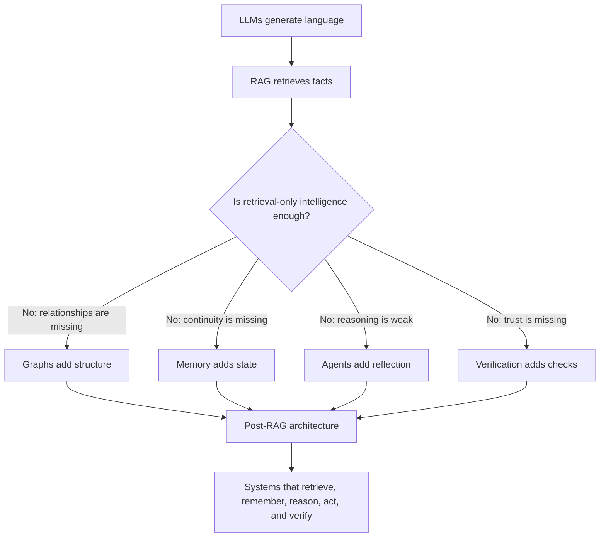

# Future & Beyond RAG

## How the Industry Is Moving Past Retrieval-Only Intelligence

RAG works, but only up to a point.

It solved one major problem:

> How do we give language models access to external knowledge?

But real systems revealed a deeper lesson:

> Giving a model information is not the same as building intelligence.

Across the earlier lessons, we saw that RAG systems fail not only because models are weak, prompts are bad, or retrieval is imperfect.

They fail because RAG is structurally limited.

---

## Problem Statement: Why We Had to Go Beyond RAG

RAG made LLM systems more useful by grounding responses in external documents.

That was a major step forward.

But production teams repeatedly discovered that retrieval alone does not solve:

- Memory
- Reasoning
- Verification
- Long-term learning
- System control
- Trust under uncertainty

RAG can retrieve facts. It cannot automatically decide whether those facts were used correctly.

The core problem:

> RAG gives the model information, but information alone is not intelligence.

---

## What RAG Actually Does

RAG is very good at:

- Retrieving documents
- Injecting facts into prompts
- Reducing pure hallucinations
- Giving answers source material
- Connecting models to private or fresh knowledge

This is why RAG became one of the most important patterns in applied AI.

But RAG has clear limits.

Basic RAG does not:

- Remember across interactions
- Reason reliably over complex evidence
- Verify its own conclusions
- Learn over time
- Enforce rules by default
- Maintain long-running state

Each query is often treated like a brand-new event.

The student-friendly version:

> Intelligence without memory is amnesia.

---

## Core Challenges That Forced the Industry Forward

From production systems, teams repeatedly hit the same walls.

### Structural Problems

Classic RAG often stores knowledge as chunks.

This creates problems:

- Flat chunks lose relationships
- Logic breaks across documents
- Constraints remain implicit
- Dependencies are guessed instead of represented

### Cognitive Problems

Even when retrieval works, the model may still:

- Cherry-pick evidence
- Ignore retrieved context
- Collapse under noisy prompts
- Misuse citations
- Reason incorrectly over correct facts

### System Problems

Production adds constraints that demos hide:

- Context windows are finite
- Prompts grow uncontrollably
- Evaluation misses silent failures
- Drift breaks correctness over time
- Security and privacy risks increase

At this point, the conclusion became clear:

> RAG was a bridge architecture, not the destination.

---

## The Post-RAG Shift

The industry did not abandon RAG.

It absorbed RAG into larger systems.

The new focus is on:

- Structure
- Memory
- Reflection
- Verification
- System-level control
- Reliability over time

RAG still matters, but retrieval is becoming one layer inside broader AI architectures.

The question changes from:

> How do we retrieve the right documents?

To:

> How do we build systems that know what they know, remember what matters, verify conclusions, and detect when they are wrong?

---

## 1. GraphRAG: From Flat Text to Structured Knowledge

Classic RAG often stores information as chunks plus embeddings.

That creates a flat view of knowledge.

The system can retrieve nearby text, but relationships are often implicit.

### The Problem with Classic RAG

Classic RAG struggles when:

- Chunks are isolated
- Relationships span documents
- Rules depend on conditions
- One policy overrides another
- Answers require multi-hop reasoning

The model has notes, but not a map.

### What GraphRAG Changes

GraphRAG represents knowledge using structure.

Instead of storing only flat chunks, it can store:

- Entities
- Relationships
- Constraints
- Dependencies
- Hierarchies
- Overrides

Examples:

| Relationship | Meaning |
|---|---|
| Policy A depends on Policy B | One rule requires another |
| Policy X overrides Policy Y | One source has priority |
| Product M belongs to Region N | A condition limits scope |
| User Role A can access System B | A permission relationship exists |

Structure replaces guesswork.

### Why This Matters

Graph-based systems can improve:

- Multi-hop reasoning
- Constraint-aware answers
- Entity disambiguation
- Relationship tracking
- Explanation paths

The key lesson:

> The model gets a map, not just notes.

---

## 2. Agentic Self-Reflection: Fixing One-Shot Reasoning

Traditional LLM workflows often generate once and stop.

That is risky because the first answer may contain:

- Missed evidence
- Logic gaps
- Contradictions
- Unsupported claims
- Incorrect assumptions

### The Agentic Shift

Agentic systems introduce loops.

Instead of one-shot generation, the system can follow a cycle:

```text
Think -> Act -> Reflect -> Retry
```

The model may:

- Generate an answer
- Check whether evidence supports it
- Critique its own logic
- Search again if context is missing
- Revise when errors are found

### What This Fixes

Reflection can help:

- Catch contradictions
- Reduce reasoning errors
- Improve complex task completion
- Recover from weak first attempts
- Make uncertainty more visible

Reflection does not make systems perfect.

But it adds a mechanism for correction.

The key lesson:

> Reflection compensates for weak one-shot reasoning.

---

## 3. Memory-First Architectures: Ending Prompt Amnesia

Context is not memory.

Context is what the model sees right now.

Memory is what the system can preserve, update, and reuse over time.

### The RAG Limitation

Basic RAG often treats each query as separate.

This means the system may not remember:

- User preferences
- Prior decisions
- Long-running goals
- Past corrections
- Project state
- Evolving task context

Every query starts too close to zero.

### What Memory-First Systems Add

Memory-first architectures introduce:

- Persistent memory
- Long-term state
- Read/write memory layers
- User-specific context
- Task-specific memory
- Summaries of prior interactions

### Why This Matters

Memory-first systems can:

- Maintain continuity over time
- Support long-running tasks
- Reduce repeated retrieval
- Learn user preferences
- Preserve project context
- Improve personalization

The key lesson:

> Intelligence without memory is not durable intelligence.

---

## 4. Verification Layers: Trust Before Fluency

Fluent answers are not automatically safe answers.

RAG gave systems:

- Citations
- References
- Retrieved evidence
- More grounded language

But it did not guarantee correctness.

### What Verification Layers Add

Verification layers check outputs before final answers are shown.

They may include:

- Fact checks
- Rule checks
- Logical validation
- Tool execution
- Citation support checks
- Safety rejection
- Schema validation
- Human review for high-risk cases

The system moves from:

> Answer confidently.

To:

> Do not just answer. Prove it.

### What This Enables

Verification layers support:

- Auditable answers
- Safer decision-making
- Enterprise-grade trust
- Better compliance
- Reduced unsupported claims
- More reliable automation

The key lesson:

> Verification turns fluent output into accountable output.

---

## The Post-RAG Stack

Students can summarize the evolution like this:

| Layer | What It Adds |
|---|---|
| LLMs | Language generation |
| RAG | External facts |
| Graphs | Structure and relationships |
| Memory | Continuity over time |
| Agents | Reflection and action loops |
| Verification | Trust and correctness checks |

This is the post-RAG stack.

RAG is still part of the system, but it is no longer the whole system.

---

## How This Connects to Earlier Lessons

Nothing earlier was wrong.

It was incomplete.

| RAG Failure | What Helps Beyond Basic RAG |
|---|---|
| Broken chunking | Graph-based structure |
| Lost context | Persistent memory |
| Weak reasoning | Agentic reflection |
| Hallucinations | Verification layers |
| Prompt bloat | System-level control |
| Hidden failures | Continuous evaluation |
| Drift | Refresh pipelines and memory updates |
| Security risks | Access-aware retrieval and policy enforcement |

The important shift is architectural.

Better prompts help, but the future is not only better prompting.

The future is better systems.

---

## Beyond RAG Flowchart



---

## Closing Insight

RAG taught us how to give models information.

The next generation of AI systems is about teaching systems how to think, remember, verify, and know when they might be wrong.

Students should leave with this final idea:

> RAG is not dead. It is becoming infrastructure, not intelligence.

The real challenge ahead is not only:

> How do we retrieve better documents?

It is:

> How do we build systems that know when they are wrong?
