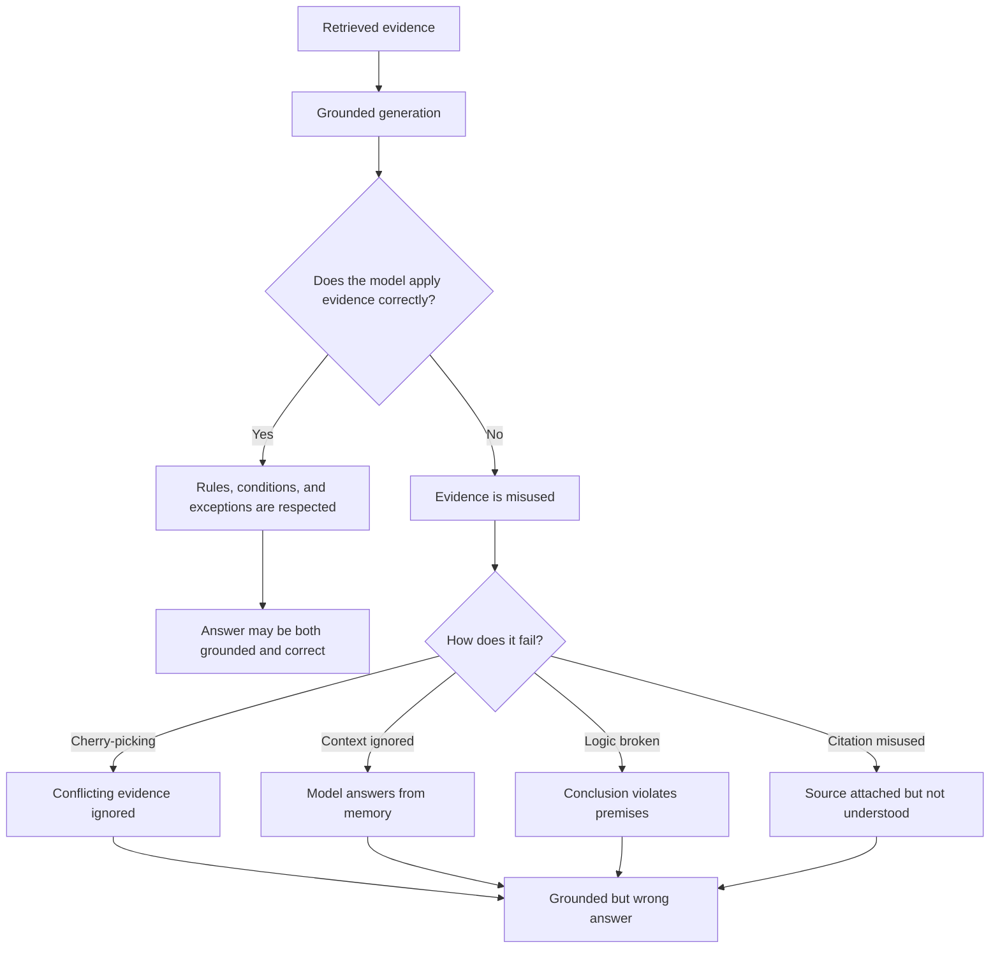

# Grounding Is Not Reasoning

## Why Having Evidence Does Not Mean Using It Correctly

Modern AI systems often say things like:

- "According to document X..."
- "Based on policy Y..."
- "As stated in the retrieved source..."

This creates a strong illusion of correctness.

Students and engineers may assume:

> If the answer has citations, it must be right.

This assumption is false.

Grounding can show where information came from. It does not prove that the information was applied correctly.

---

## Problem Statement: The Illusion of Correctness

RAG makes answers look more trustworthy because the model can refer to external evidence.

That is useful, but it creates a new risk.

An answer can:

- Include citations
- Reference real documents
- Quote relevant text
- Sound structured and confident
- Still be logically wrong

The danger is that the answer looks grounded, so people may trust it before checking the reasoning.

This lesson exists to separate two ideas that are often confused:

> Grounding is about evidence. Reasoning is about correctly using evidence.

---

## The Core Truth

RAG can give the model facts.

It cannot force the model to think correctly about those facts.

This is one of the most important conceptual boundaries in RAG systems.

A model can be shown the right source and still:

- Ignore the key condition
- Miss an exception
- Combine facts incorrectly
- Contradict the document
- Draw an unsupported conclusion

Grounding is necessary, but it is not sufficient.

---

## Grounding vs Reasoning

Grounding and reasoning answer different questions.

| Concept | Meaning | Question It Answers |
|---|---|---|
| Grounding | The answer references retrieved documents or external sources | Where did this information come from? |
| Reasoning | The answer correctly applies rules, conditions, and logic | Was this information applied correctly? |

RAG improves grounding by retrieving external context.

But RAG does not automatically add a logic engine, proof system, or global consistency checker.

The critical distinction:

> RAG solves grounding. RAG does not solve reasoning.

This is where many systems silently fail.

---

## 1. Evidence Cherry-Picking

Evidence cherry-picking happens when the model uses only the evidence that supports the answer it is already generating.

It ignores conflicting evidence, exceptions, or constraints.

### Why This Happens

LLMs generate text left to right.

Early tokens influence later tokens. Once the model starts moving in one direction, it may continue building support for that direction instead of globally checking all evidence.

This can happen when:

- The retrieved context is long
- Evidence conflicts
- Exceptions appear after the main rule
- The model starts with a plausible answer
- The prompt does not force comparison across sources

### Simple Example

Retrieved documents contain:

- A rule
- An exception to that rule

The model cites the rule but ignores the exception.

The answer is grounded because the cited rule exists.

But the answer is wrong because the exception changes the conclusion.

The key lesson:

> A grounded answer can still be incomplete if it uses only convenient evidence.

---

## 2. Ignoring Retrieved Context

Sometimes the model receives relevant context but does not actually use it.

This means retrieval succeeded, but generation failed to incorporate the evidence.

### Why This Happens

The model may ignore context when:

- The prompt is too long
- Important evidence appears in the middle
- Retrieved chunks contain too much noise
- The model's prior training strongly suggests another answer
- The user question resembles a common pattern from training data

In this case, the model may default to what it already "knows" instead of what the retrieved text says.

### What Breaks

When retrieved context is ignored:

- The model answers from memory
- Retrieval becomes decoration
- Citations may be added after the fact
- The system appears to be using RAG, but is not truly grounded

This is dangerous because the system looks like it is working.

The key lesson:

> Seeing evidence is not the same as using evidence.

---

## 3. Logical Inconsistencies

Logical inconsistency happens when the answer sounds fluent but the reasoning does not follow.

The answer may:

- Contradict itself
- Apply a condition incorrectly
- Draw a conclusion that violates the premises
- Treat an exception as the main rule
- Combine unrelated facts into one claim

Everything may sound natural. The logic is still broken.

### Why This Happens

LLMs are not explicit logic engines.

They are trained to produce likely text, not to prove that every conclusion follows from every premise.

By default, there may be no:

- Formal proof step
- Constraint solver
- Consistency checker
- Verification pass
- Guaranteed rule application

Pattern matching can look like deduction, but it is not the same thing.

### Consequence

The model may produce:

- Fluent reasoning
- Confident explanation
- Clean structure
- Invalid logic

Humans often notice only after the answer has already influenced a decision.

The key lesson:

> Fluency can hide broken logic.

---

## 4. Fluent but Incorrect Synthesis

Fluent but incorrect synthesis is one of the most dangerous failures in AI systems.

The answer:

- Sounds confident
- Looks well organized
- Includes citations
- Combines multiple sources
- Feels professional

But the conclusion is wrong.

### Why This Happens

LLMs are very good at producing coherent text.

That strength can become a risk.

The model may synthesize retrieved evidence into an answer that sounds reasonable, even when:

- The evidence is incomplete
- The sources conflict
- The conclusion requires a missing condition
- A citation supports only part of the claim
- The model has blended multiple facts incorrectly

The answer may look more reliable than it is because it is polished.

### Why It Is Dangerous

People often trust:

- Confidence
- Structure
- Source names
- Citations
- Professional tone

But none of those guarantee correctness.

The key lesson:

> The better the answer sounds, the more carefully its reasoning must be checked.

---

## 5. Citation Without Understanding

Citation without understanding happens when the model attaches a source but applies it incorrectly.

The citation exists, but the reasoning is wrong.

### Simple Example

A policy says:

> Contractors may access System Y only after manager approval.

The model answers:

> Contractors may access System Y.

It cites the policy, but ignores the approval condition.

The source is real. The conclusion is incomplete.

### Why This Happens

Citations can be pattern-matched.

The model may learn that answers should include a source, but citation formatting does not guarantee logical validation.

The system may not verify:

- Whether the cited source actually supports the full claim
- Whether all conditions were applied
- Whether exceptions were included
- Whether the conclusion follows from the cited text

The key lesson:

> A citation proves that a source was referenced. It does not prove that the source was understood.

---

## Why This Is a Hard Limit of Basic RAG

This is not just a tuning problem.

Better retrieval can help. Better prompts can help. Better models can help.

But basic RAG does not automatically add reasoning guarantees.

Why?

- LLMs do not reliably check logic by default
- RAG does not add a formal reasoning mechanism
- Citations do not enforce correctness
- Retrieved evidence can be incomplete or misapplied
- The model can still synthesize plausible but invalid conclusions

Grounding reduces one class of risk, but it does not eliminate reasoning risk.

The key lesson:

> Grounding is a reliability tool, not a correctness guarantee.

---

## The Mental Model

Students should remember this:

```text
Retrieval provides facts
Grounding provides references
Reasoning requires structure
RAG gives evidence, not guaranteed understanding
```

Another way to say it:

| Layer | What It Provides | What It Does Not Guarantee |
|---|---|---|
| Retrieval | Relevant context | Complete truth |
| Grounding | Source references | Correct application |
| Citations | Traceability | Logical support |
| Generation | Fluent answer | Valid reasoning |

This is the boundary students must understand before trusting RAG systems in real-world workflows.

---

## Grounding Failure Flowchart



---

## Closing Insight

A model can be perfectly grounded and still be wrong.

This is the moment students should understand:

- Why enterprise AI failures are subtle
- Why citations alone are not enough
- Why trust is hard
- Why evaluation is critical

The transition to remember:

> If grounding does not guarantee reasoning, the next question is how we detect failures before users trust them.
