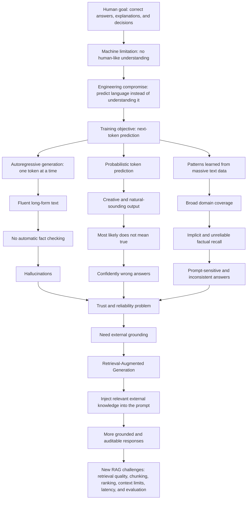

# How Large Language Models (LLMs) Actually Work

## Why Failures Are Inevitable

This note explains why LLMs are useful, why they fail, and why Retrieval-Augmented Generation (RAG) exists as a system-level response to those failures.

---

## 1. Problem Statement: What Are We Trying to Solve?

Humans want machines to:

- Understand language
- Answer questions correctly
- Explain things logically
- Help with decisions

The hard truth is that computers do not understand language the way humans do.

They do not naturally:

- Know facts
- Understand meaning
- Reason about the world

So engineers asked a simpler question:

> If a machine cannot understand language, can it at least predict language well enough to be useful?

Almost everything in modern LLMs comes from this compromise.

---

## 2. The Core Constraint: Machines Predict, They Do Not Understand

An LLM mainly does one thing:

> Given some text, predict what comes next.

It is not directly asking:

- Is this true?
- Does this make sense?
- Is this logically correct?

It is asking:

> What token is most likely next?

This design choice solves one major problem: it allows machines to generate fluent language. But it also creates many downstream problems.

---

## 3. Autoregressive Language Modeling

Autoregressive language modeling means the model generates text one token at a time.

Example:

```text
The capital of France is ___
```

The model predicts that `Paris` is likely, outputs it, and then predicts the next token again.

### Problem It Solved

Before this approach, models struggled to generate long, coherent text. Outputs often broke after a few words.

Autoregressive modeling enabled:

- Long-form text generation
- Coherent paragraphs
- Essays, code, and explanations
- Fluent conversation

### New Problem Created

The model does not automatically check facts, pause to verify, or ask whether the answer is correct.

It only asks:

> What comes next?

So correctness becomes accidental, not guaranteed.

This is one root cause of hallucinations.

---

## 4. Probabilistic Token Prediction

For every next token, the model produces probabilities.

Example:

```text
Token A -> 45%
Token B -> 30%
Token C -> 10%
```

The model then selects or samples from those possibilities.

### Problem It Solved

Earlier deterministic systems were rigid, repetitive, and robotic.

Probability introduced:

- Creativity
- Variation
- Natural-sounding language
- Less repetitive output

This is one reason LLMs feel human-like.

### New Problem Created

The most likely token is not always the correct token.

Probability is not truth.

If something appears frequently in training data, the model may confidently repeat it even if it is wrong.

This creates confidently wrong answers.

---

## 5. Training Objective: Next-Token Prediction

LLMs are trained primarily on one task:

> Predict the next token given previous tokens.

They are not directly trained to:

- Verify facts
- Check logic
- Say "I do not know"
- Validate sources

### Problem It Solved

Hand-written rules and symbolic systems do not scale well. They are hard to maintain and brittle across domains.

Next-token prediction enabled:

- Massive scalability
- Learning from internet-scale data
- One model that can operate across many domains
- Foundation models

### New Problem Created

The model has no built-in truth checker.

It learns how language looks, not necessarily how the world works.

This leads to pattern matching instead of reliable reasoning.

---

## 6. Why LLMs Do Not "Know" Facts

A common misunderstanding is:

> The model knows facts because it was trained on data.

A better mental model is:

- Facts are not stored like rows in a database
- Knowledge is distributed across model weights
- Retrieval from memory is implicit and unreliable
- Similar facts can blend together

Asking a factual question is like hoping the right learned pattern activates at the right time.

### Consequences

Facts can be:

- Incomplete
- Mixed together
- Contradictory
- Sensitive to prompt wording

This is why answers can change across prompts.

---

## 7. Pattern Matching vs Reasoning

What LLMs often do:

- "This question looks familiar"
- "This answer sounds right"
- "This explanation matches a known pattern"

What reliable reasoning would require:

- Step-by-step logic
- Causal understanding
- Verifiable intermediate steps
- Error detection

LLMs can produce reasoning-like text, but the reasoning process is fragile because reasoning was not the original training objective.

### New Problem Created

LLMs can produce beautiful explanations for wrong logic.

They can sound persuasive while reaching incorrect conclusions.

This is risky in real-world systems.

---

## 8. Confidence Is Not Correctness

LLMs sound confident because:

- Training rewards fluent answers
- Polished language often appears useful
- The model does not have reliable internal uncertainty awareness
- Many interfaces encourage direct answers

The result:

- Wrong answers sound polished
- Hallucinations feel authoritative
- Users may trust incorrect output

This is where trust breaks.

---

## 9. Sampling Controls: Temperature and Top-p

Sampling controls change how the model chooses among likely next tokens.

### Why They Exist

Always choosing the top token can produce boring, repetitive text.

Sampling introduces:

- Diversity
- Creativity
- Variation in tone and wording

### New Problem Created

More randomness can increase hallucinations.

Less randomness can make outputs rigid.

Sampling controls style and variability. They do not guarantee correctness.

---

## 10. The Full Chain of Problems

The key insight:

- LLMs generate language, not truth
- Autoregression creates fluency
- Probability creates variation and confidence
- Next-token training creates scale
- None of these guarantee understanding

LLM failures are structural, not just bugs.

---

## 11. End-to-End Failure Flowchart



---

## 12. Why This Leads to RAG

RAG exists because LLMs:

- Cannot reliably recall facts
- Cannot verify correctness by themselves
- Can hallucinate confidently
- Need external grounding for domain-specific answers

Retrieval-Augmented Generation injects external, verifiable information into the model's context before generation.

RAG does not make LLMs perfect. It changes the problem from:

> Can the model remember the right answer?

to:

> Can the system retrieve the right evidence and make the model use it correctly?

That is why RAG is a system design pattern, not just a model feature.

---

## Summary

LLMs are powerful because they predict language at scale. They fail because language prediction is not the same as truth, reasoning, or verification.

RAG is introduced to reduce this gap by grounding the model in external knowledge, but it also introduces its own system-level design challenges.
