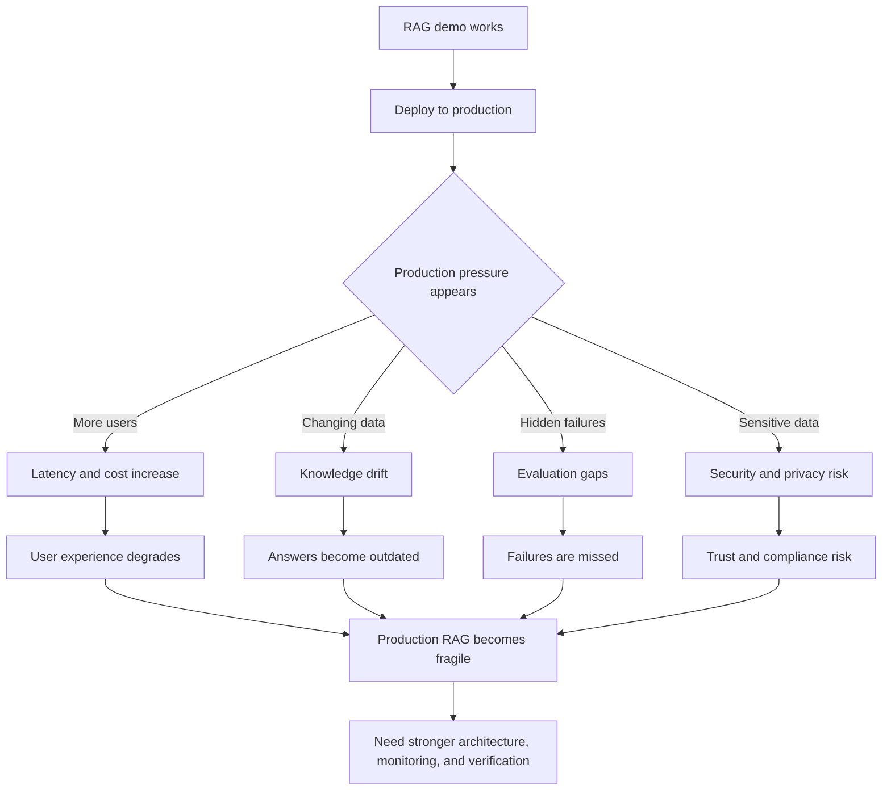

# Production Challenges in RAG Systems

## Why RAG Systems Fail After Deployment, Not in Demos

Many RAG systems look impressive before deployment.

They work well in notebooks. They answer curated examples. They perform well with small datasets and a few users.

Then production changes everything.

Responses become slower. Costs rise. Answers quietly degrade. Security questions appear. Bugs are reported by users before they are caught by metrics.

This is not accidental.

> RAG systems usually fail not because the model is weak, but because production introduces constraints that demos hide.

---

## Problem Statement: Why Does My RAG System Work in Demos but Fail in Production?

In a demo, the system often has:

- A small document set
- Clean examples
- Predictable questions
- Limited traffic
- Manual evaluation
- Freshly indexed data
- Friendly users

In production, the system faces:

- Messy documents
- Changing knowledge
- Many user intents
- Higher traffic
- Latency pressure
- Cost constraints
- Security requirements
- Hard-to-detect failures

The result is a painful surprise:

> A RAG system can be easy to prototype and hard to operate.

Production does not merely test whether the model is smart. It tests whether the entire system can stay accurate, fast, affordable, secure, and observable over time.

---

## The Big Picture: What Changes in Production

Before deployment, teams usually focus on:

- Prompt quality
- Retrieval accuracy
- Model choice
- Chunking strategy
- Demo examples

After deployment, new forces dominate:

- Latency
- Cost
- Knowledge drift
- Evaluation gaps
- Security and privacy risks
- Operational reliability

These are system problems, not prompt problems.

The key shift:

> In demos, RAG is an AI feature. In production, RAG is a distributed system.

---

## 1. Latency and Cost

A single RAG query can trigger many steps:

1. User query processing
2. Query embedding
3. Vector search
4. Metadata filtering
5. Re-ranking
6. Prompt assembly
7. LLM inference
8. Citation formatting
9. Logging and monitoring

Each step adds time.

Latency stacks across the pipeline.

### Why This Becomes a Problem

Production systems often depend on multiple services.

Each service can add:

- Network latency
- Queueing delay
- Retry delay
- Cold starts
- Rate limits
- Timeout risk

Larger prompts also make LLM inference slower and more expensive.

Retrieving more chunks may improve recall, but it also increases token usage and response time.

### Real-World Impact

Latency and cost affect:

- User experience
- API timeouts
- Infrastructure budgets
- Rate-limit planning
- Product adoption
- System reliability during traffic spikes

The cost grows with:

- Token usage
- Number of retrieved chunks
- Re-ranking calls
- Embedding calls
- Model size
- Number of users

The key lesson:

> RAG is cheap in demos and expensive at scale.

---

## 2. System Drift

Drift means the system becomes less correct over time.

In production, knowledge changes:

- Policies update
- Documents are revised
- Products change
- Prices change
- Regulations change
- Business rules evolve
- Old documents are replaced

But the RAG system may not update at the same speed.

### Why Drift Happens

Drift appears when:

- Embeddings are not refreshed
- Vector indexes are treated as set-and-forget
- Old and new documents coexist
- Re-indexing pipelines are manual
- Document deletion is not propagated
- Metadata does not update correctly
- Evaluation datasets become stale

The model may still answer confidently, but it may be answering from yesterday's truth.

### What Breaks

Drift causes:

- Outdated answers
- Conflicting retrieved evidence
- Incorrect policy guidance
- Version confusion
- Silent accuracy decay
- Loss of user trust

The dangerous part is that drift often does not look like a system failure.

The system still runs. The API still returns answers. The UI still looks normal.

But correctness is slowly decaying.

The key lesson:

> The system looks stable, but answers the past.

---

## 3. Evaluation Metrics

The core production question is:

> How do you know your RAG system is wrong?

This is harder than it sounds.

Simple accuracy checks are not enough because RAG can fail in many hidden ways.

An answer can:

- Look correct
- Include citations
- Use fluent language
- Reference retrieved context
- Still misuse the evidence

### Why Evaluation Is Difficult

RAG evaluation is difficult because there are multiple things to measure:

- Did retrieval find the right evidence?
- Was the retrieved context relevant?
- Did the model use the evidence?
- Did the answer follow from the evidence?
- Were citations actually supportive?
- Did the answer remain consistent over time?
- Did the system refuse when evidence was missing?

Many teams only evaluate the final answer.

That hides the failure source.

### Commonly Missing Metrics

Production RAG systems often miss metrics such as:

- **Context precision**: Was the retrieved information relevant?
- **Context recall**: Did retrieval include the needed evidence?
- **Faithfulness**: Did the answer stay supported by the evidence?
- **Evidence usage**: Did the model actually use the retrieved text?
- **Citation support**: Do cited sources support the claims?
- **Answer consistency**: Does the system answer similar questions consistently?
- **Freshness**: Is the retrieved knowledge current?

Without these metrics, failures are discovered through user complaints or real-world damage.

The key lesson:

> If you cannot measure RAG failures, users become your monitoring system.

---

## 4. Security and Privacy

RAG changes the security surface of an AI system.

It introduces:

- New data flows
- Retrieved documents in prompts
- Untrusted document content
- Access-controlled knowledge
- Sensitive internal context
- More places for leakage or misuse

This means RAG is not only an AI design problem. It is also a security design problem.

### Key Risks

Common RAG security risks include:

- Prompt injection through retrieved documents
- Over-retrieval of sensitive data
- Access control mismatches
- Cross-user data leakage
- Logging of private context
- PII or PHI exposure
- Compliance violations
- Retrieval from documents the user should not see

### Why This Is Dangerous

The LLM may treat retrieved text as trusted instruction or trusted evidence.

But retrieved documents may be:

- Malicious
- Outdated
- User-generated
- Confidential
- Incorrectly permissioned
- Not intended as instructions

Security failures in RAG can look like reasoning failures, but they are system flaws.

The key lesson:

> The LLM should not automatically trust retrieved content just because retrieval returned it.

---

## Why These Problems Appear Only in Production

Demos hide production constraints.

| Demo Environment | Production Environment |
|---|---|
| Small data | Large, messy, changing data |
| Friendly queries | Ambiguous and adversarial queries |
| Manual testing | Continuous evaluation needed |
| Low traffic | Latency and scaling pressure |
| Clean permissions | Complex access control |
| Fresh index | Knowledge drift over time |
| Curated examples | Unknown failure cases |

This is why a RAG demo can feel reliable even when the production system is fragile.

The demo proves the idea can work.

Production tests whether it keeps working.

---

## The Mental Summary

Students should remember production failures this way:

| Challenge | What It Breaks |
|---|---|
| Latency | User experience and reliability |
| Cost | Scale and sustainability |
| Drift | Correctness over time |
| Poor metrics | Failure detection |
| Security gaps | Trust, privacy, and compliance |

Another compact version:

```text
Latency slows systems
Cost limits scale
Drift breaks correctness
Poor metrics hide failures
Security gaps destroy trust
```

The larger lesson:

> Production is where RAG meets reality.

---

## Why This Forces the Next Evolution

Production challenges reveal that pure RAG is not enough for many high-stakes systems.

Why?

- Prompts do not fix latency
- Retrieval does not stop drift
- Grounding does not guarantee safety
- Citations do not prove reasoning
- Evaluation does not catch everything
- Bigger models do not remove system complexity

So teams move beyond basic RAG toward:

- Memory-augmented systems
- Tool-verified reasoning
- Agent-based workflows
- Human-in-the-loop review
- Stronger observability
- Access-aware retrieval
- Continuous evaluation pipelines

These additions do not replace RAG. They make RAG more operationally reliable.

---

## Production Failure Flowchart



---

## Closing Insight

RAG is easy to build, hard to maintain, and unforgiving in production.

Students should now understand:

- Why RAG demos can be misleading
- Why production failures are subtle
- Why reliability requires system design
- Why the future goes beyond just RAG

The transition to remember:

> Once RAG reaches production, the next step is building systems that can remember, verify, act, and monitor themselves more reliably.
