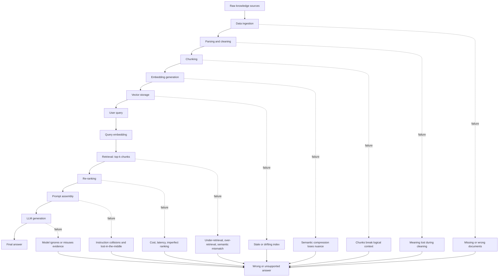

# RAG Architecture: End-to-End

## Why Most RAG Failures Are Pipeline Failures, Not Model Failures

By now, the core motivation for RAG should be clear:

- LLMs hallucinate
- Context is limited
- Knowledge becomes stale
- RAG was introduced to ground answers in external information

But there is a hidden truth students must understand:

> RAG is not a model. RAG is a multi-stage data pipeline.

And every stage in that pipeline can fail silently.

When a RAG system gives a wrong answer, people often blame the LLM. In reality, the failure usually happened before the model ever saw the question.

---

## The Big Mental Model

RAG works in two major phases:

| Phase | Purpose |
|---|---|
| Offline / preprocessing | Prepare knowledge so it can be retrieved later |
| Online / query time | Retrieve, assemble, and generate an answer |

If any stage in the chain is weak, the final answer can be wrong even if the LLM is very capable.

The answer quality is bounded by the pipeline quality.

---

## 1. Data Ingestion

Data ingestion is where raw knowledge enters the RAG system.

This may include:

- PDFs
- Word documents
- Web pages
- Databases
- Support tickets
- Product documentation
- Policies

### Why This Stage Exists

Before RAG, enterprise knowledge lived across many systems. LLMs could not automatically access private documents, internal databases, or updated operational knowledge.

Ingestion solves this by bringing knowledge into a system where it can later be searched and retrieved.

### Challenges Introduced

This stage fails more often than people realize.

Documents may be missing. Wrong versions may be ingested. Edge-case documents may be skipped. Access-controlled documents may be excluded accidentally. Duplicate documents may enter the system and create conflicting answers.

If data never enters the system, it can never be retrieved.

This is the first form of garbage-in.

---

## 2. Parsing and Cleaning

Parsing converts raw documents into text that the system can process.

Cleaning may include:

- Removing headers and footers
- Normalizing formatting
- Extracting text from PDFs
- Flattening tables and lists
- Removing duplicate or irrelevant content

### Why This Stage Exists

Raw documents are messy.

They contain formatting, page numbers, navigation text, tables, images, footnotes, and layout structure. This noise can hurt embedding quality and retrieval quality.

Cleaning tries to make the text easier to search.

### Challenges Introduced

Clean text is not always faithful text.

Cleaning can remove meaning. Table structure can be lost. Hierarchies can disappear. Sentences can break. A policy exception that was clear in a table may become confusing when flattened into plain text.

The key lesson:

> Clean text is not the same as faithful text.

---

## 3. Chunking

Chunking splits documents into smaller pieces called chunks.

### Why Chunking Exists

Full documents often do not fit into the context window. Even when they fit, passing full documents is expensive and noisy.

Chunking allows the system to retrieve smaller units of knowledge and assemble only the most relevant pieces into the prompt.

### Challenges Introduced

Chunking is one of the most important RAG failure points.

Meaning often spans multiple paragraphs, pages, tables, or sections. If the chunk boundary cuts through a logical chain, the retrieved chunk may contain only part of the answer.

Chunking can separate:

- Assumptions from conclusions
- Definitions from exceptions
- Policy rules from eligibility criteria
- Table headers from table values
- Examples from the rule they explain

The model retrieves fragments, not understanding.

This is why chunking can quietly destroy meaning before retrieval even begins.

---

## 4. Embedding Generation

Embedding generation converts each chunk into a vector, which is a list of numbers that represents semantic meaning.

### Why Embeddings Exist

Keyword search can miss meaning.

For example, a user may ask about "refund eligibility" while the document uses the phrase "return qualification." A keyword system may miss that match, but embeddings can capture semantic similarity.

Embeddings enable semantic search.

### Challenges Introduced

Embeddings compress meaning.

That compression is useful, but it loses detail. Numbers, tables, formulas, legal clauses, domain-specific terms, and subtle distinctions can be poorly represented.

The important lesson:

> Semantic similarity is not the same as relevance.

Two chunks can sound similar while only one actually answers the question.

---

## 5. Vector Storage

Vector storage stores embeddings in a vector database or vector index so the system can search them quickly.

### Why This Stage Exists

Production systems may contain thousands, millions, or billions of chunks.

Vector storage enables fast similarity search across large collections.

### Challenges Introduced

Indexes can drift from reality.

Documents change. Policies are updated. Pages are deleted. New versions replace old versions. If embeddings and indexes are not refreshed correctly, the system may retrieve outdated information.

Common issues include:

- Stale embeddings
- Duplicate chunks
- Missing deletes
- Mixed index versions
- Incorrect metadata
- Access-control mistakes

The system may confidently answer from outdated reality.

---

## 6. Retrieval

Retrieval happens at query time.

Given a user question, the system searches the vector database and selects the top-k most similar chunks.

### Why Retrieval Exists

Passing all data to the model is impossible.

Retrieval selects what appears relevant and sends only that selected context to the LLM.

### Challenges Introduced

Retrieval is a major failure point.

Three common failures are:

| Failure | What Happens |
|---|---|
| Under-retrieval | The system misses key facts |
| Over-retrieval | The system retrieves too much noise |
| Semantic mismatch | Similar wording retrieves the wrong meaning |

Retrieval quality defines answer quality.

If the right evidence is not retrieved, the LLM cannot use it.

This is garbage-in, garbage-out in action.

---

## 7. Re-Ranking

Re-ranking takes the initially retrieved chunks and re-orders them using a stronger relevance model.

### Why This Stage Exists

Vector similarity is useful, but it is not always precise.

Re-ranking helps place the most relevant chunks closer to the top so the best evidence is more likely to be included in the final prompt.

### Challenges Introduced

Re-ranking improves retrieval, but it does not guarantee correctness.

It adds:

- Latency
- Cost
- More system complexity
- Another heuristic decision point

Re-ranking can improve evidence selection, but it does not fix reasoning.

---

## 8. Prompt Assembly

Prompt assembly builds the final prompt that will be sent to the LLM.

It may include:

- System instructions
- Developer instructions
- Retrieved chunks
- Conversation history
- User question
- Output format requirements
- Safety constraints

### Why This Stage Exists

The model needs guidance, context, and constraints.

Prompt assembly is where the system decides how to present retrieved evidence to the model.

### Challenges Introduced

Prompt assembly can break RAG even when retrieval succeeds.

Common failures include:

- Instruction collisions
- Retrieved evidence buried under too much text
- Lost-in-the-middle effects
- Conflicting chunks placed together
- Important context placed too late
- Conversation history overshadowing retrieved evidence

At scale, the prompt itself becomes the bottleneck.

The system may retrieve the right evidence but assemble it in a way the model does not use well.

---

## 9. Generation

Generation is the final stage where the LLM produces the answer.

By this point, the model receives the assembled prompt and generates a response.

### Final Reality

Even at this last step, failure is still possible.

The model may:

- Ignore retrieved text
- Cherry-pick evidence
- Overgeneralize from one chunk
- Fail to reconcile conflicting chunks
- Hallucinate unsupported details
- Answer from prior knowledge instead of provided context

The critical truth:

> Retrieval does not guarantee usage.

RAG gives the model evidence. It does not force the model to reason correctly over that evidence.

---

## 10. One-Slide Failure Summary

Students should remember:

- Data can be missing
- Parsing can remove meaning
- Chunks can break logic
- Embeddings can mislead
- Indexes can become stale
- Retrieval can miss the right evidence
- Re-ranking can still order evidence poorly
- Prompts can collapse under noise
- Models can ignore retrieved context

Every stage multiplies risk.

That is why RAG quality is a system property, not just a model property.

---

## 11. End-to-End RAG Architecture Flowchart

---

## Closing Insight

RAG does not usually fail only at generation.

It often fails long before the model ever sees the question.

The transition to remember:

> Now that we understand the full RAG pipeline, the first major breaking point to study deeply is chunking.
