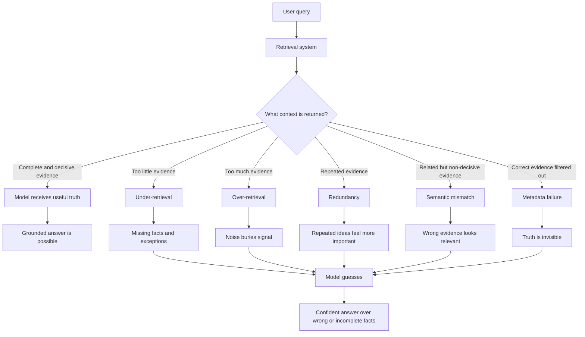

# Retrieval Failure Modes

## Where RAG Actually Breaks

At this stage, students often believe:

> If the LLM is powerful and embeddings are good, answers should be correct.

But real-world RAG systems reveal a harsher truth:

> RAG usually fails not because the LLM is weak, but because retrieval feeds the model the wrong reality.

This leads to one of the most important principles in RAG:

> In RAG systems, retrieval is the single point of truth.

If retrieval is wrong, the model has no chance, even if it is very capable.

---

## Problem Statement: Why Good Models Still Give Wrong Answers

The LLM can only reason over what it receives.

If retrieved chunks are missing, outdated, incomplete, redundant, or misleading, the final answer will inherit those problems.

The model may still sound fluent. It may even cite retrieved evidence. But the answer can be wrong because the evidence itself was wrong, incomplete, or irrelevant.

This is the dangerous part:

> RAG can make wrong answers look more trustworthy.

The answer is no longer just a hallucination from model memory. It is a grounded answer built on bad retrieval.

---

## The Big Idea: What Retrieval Really Controls

Retrieval decides:

- What the model sees
- What the model never sees
- What evidence seems important
- What the model assumes is true
- Which facts are available for reasoning

So retrieval errors are not small mistakes.

They define the entire answer space.

Once retrieval is wrong, generation can only fail gracefully or fail confidently.

---

## 1. Garbage-In, Garbage-Out

Garbage-in, garbage-out means the model produces poor answers because the retrieved evidence is poor.

In RAG, retrieved chunks may be:

- Incomplete
- Incorrect
- Outdated
- Poorly parsed
- Poorly chunked
- Missing key context
- Taken from the wrong document version

The LLM is not necessarily broken. It is doing what it was asked to do: answer using the provided context.

### Why This Happens

Garbage enters retrieval when:

- Important documents were never ingested
- Parsing removed key meaning
- Tables or lists were flattened incorrectly
- Chunking broke logical connections
- Embeddings distorted query intent
- Old versions were indexed with new versions
- Access or metadata rules selected the wrong source

Retrieval then faithfully returns bad inputs.

### Why This Is Dangerous

This can be worse than an obvious hallucination.

The model may:

- Answer confidently
- Sound grounded
- Cite retrieved text
- Appear trustworthy
- Still be wrong

This creates grounded misinformation:

> Wrong answers that look reliable because they are connected to retrieved evidence.

---

## 2. Under-Retrieval

Under-retrieval happens when the system retrieves too little evidence.

The right answer may require multiple chunks, but only one or two are returned.

### Why It Happens

Under-retrieval can be caused by:

- Top-k being too small
- Similarity thresholds being too strict
- Metadata filters being too aggressive
- Query wording not matching the document
- Embeddings failing on domain-specific language
- Required evidence being split across chunks

The system becomes overconfident in a narrow view.

### What Breaks

When the system retrieves too little, the model may miss:

- Key assumptions
- Exceptions
- Eligibility criteria
- Supporting context
- Definitions
- Cross-references
- Contradicting evidence

Then the model fills gaps by guessing.

The key lesson:

> Under-retrieval forces hallucination, even inside a RAG system.

---

## 3. Over-Retrieval

Over-retrieval happens when the system retrieves too many chunks.

Teams often do this with good intentions:

> Retrieve more context so the answer is more likely to be included.

This can improve recall, but it often damages precision.

### What Actually Happens

When too much context is retrieved, the prompt becomes crowded with:

- Irrelevant chunks
- Repeated chunks
- Weakly related chunks
- Conflicting chunks
- Old or low-quality chunks
- Related but non-decisive evidence

The model sees more text, but not necessarily more useful evidence.

### What Breaks

Over-retrieval causes:

- Noise overwhelming signal
- Important chunks getting buried
- Lost-in-the-middle effects
- More opportunities for contradiction
- Higher prompt cost
- More complex reasoning over irrelevant context

The key lesson:

> More context is not automatically better context.

---

## 4. Redundant Chunks

Redundant chunks are retrieved chunks that say nearly the same thing.

They may differ only slightly, or they may come from overlapping chunks, repeated templates, or multiple document versions.

### Why This Happens

Redundancy can come from:

- Chunk overlap
- Near-duplicate documents
- Repeated sections across manuals
- Versioned policies
- Boilerplate text
- Frequently repeated headings or disclaimers

This is especially common in large enterprise knowledge bases.

### Why This Is Harmful

Redundant chunks:

- Waste context window space
- Crowd out unique information
- Make the retrieved set look more complete than it is
- Bias the model toward repeated ideas
- Increase the chance that weak evidence appears important

Important insight:

> Repetition does not equal importance, but the model may treat it that way.

If the same partial rule appears five times and the exception appears zero times, the model may answer confidently from the repeated partial rule.

---

## 5. Irrelevant but Semantically Close Chunks

This failure happens when retrieved chunks are related to the query but do not answer it.

They may:

- Share vocabulary
- Mention the same topic
- Describe the same product
- Sound semantically similar
- Still lack decisive evidence

### Why This Happens

Embeddings optimize for similarity, not decision-making intent.

Semantic closeness does not guarantee that a chunk contains the answer.

Example:

| User Query | Retrieved Chunk | Problem |
|---|---|---|
| Is Feature X allowed? | Feature X overview | Related topic, not permission rule |
| Can contractors access System Y? | Contractor onboarding guide | Related role, not access policy |
| What is the refund exception? | Refund policy summary | Related policy, missing exception |

### What Breaks

The model may answer using related but insufficient information.

It may miss:

- The rule
- The exception
- The condition
- The authority source
- The operational constraint

The answer sounds reasonable, but it is logically unsupported.

The key lesson:

> Related evidence is not the same as decisive evidence.

---

## 6. Metadata Filter Failures

Metadata filters narrow retrieval using fields such as:

- Date
- Region
- Product
- Version
- Author
- User role
- Document type
- Access permission

Filters are useful because raw semantic retrieval can be noisy.

For example, a system may need to retrieve only documents for a specific product version, customer region, or employee role.

### Why Filters Exist

Without filters:

- Too many documents may match
- Old documents may compete with new ones
- Irrelevant regions may appear
- The wrong product documentation may be retrieved
- The model may receive conflicting evidence

Metadata filters reduce the search space.

### New Problems Introduced

Filters can silently remove the truth.

This happens when:

- Documents are mis-tagged
- Metadata is missing
- A filter is too strict
- A user role is mapped incorrectly
- A date range excludes relevant policy
- A document belongs to multiple categories but has only one tag

The model never sees the correct answer and does not know it missed anything.

The key lesson:

> Metadata filters can improve precision, but over-filtering can make truth invisible.

---

## The Mental Map

Students can summarize retrieval failures this way:

| Failure Mode | Core Problem | Result |
|---|---|---|
| Garbage-in, garbage-out | Retrieved evidence is bad | Grounded misinformation |
| Under-retrieval | Too little evidence | Missing facts and forced guessing |
| Over-retrieval | Too much evidence | Noise overwhelms signal |
| Redundant chunks | Same evidence repeats | Bias and wasted context |
| Semantic mismatch | Related text is not decisive | Plausible but unsupported answers |
| Metadata failure | Filters hide the truth | Correct evidence is never seen |

The larger lesson:

> Retrieval does not just fail. It misleads.

---

## Why Retrieval Is the Core RAG Breaking Point

The LLM usually assumes the retrieved context is relevant.

It does not automatically know:

- What was not retrieved
- Whether the retrieved chunks are complete
- Whether a better document exists
- Whether a metadata filter removed the truth
- Whether a repeated chunk is actually important

So retrieval errors are amplified, not corrected.

The smarter the model, the more fluently it can reason over bad input.

This is why strong models can still produce strong-sounding wrong answers in RAG systems.

---

## Retrieval Failure Flowchart

---

## Closing Insight

RAG breaks not only when the model hallucinates.

It breaks when the model confidently reasons over the wrong facts.

That is one of the most dangerous failure modes in enterprise AI.

The transition to remember:

> Even if retrieval finds useful chunks, the next question is how to pack that context into a prompt without breaking reasoning.
