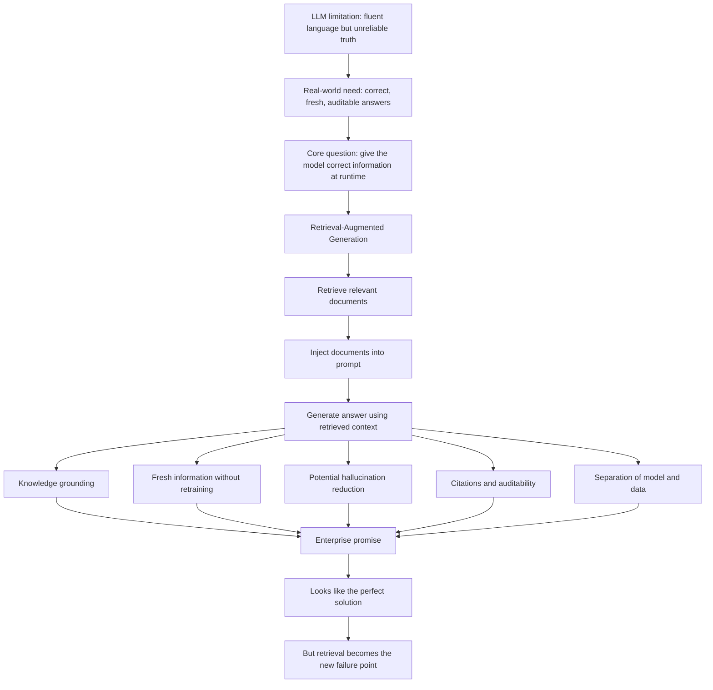

# Why RAG Exists: The Promise

## How the Industry Tried to Fix LLM Limitations

By this point, the central lesson should be clear:

> LLMs are excellent at generating language, but terrible at guaranteeing truth.

From the earlier chapters, we learned that LLMs:

- Do not "know" facts like a database
- Forget or ignore context due to context window limits
- Hallucinate confidently
- Cannot verify correctness by default
- Are frozen at a training cutoff

This created a serious problem for real-world use.

Enterprises need correct answers. They need sources. They need fresh information. They need auditability. They need a way to show where an answer came from.

So the industry asked a simple but powerful question:

> What if we give the model the correct information at runtime?

That question led to Retrieval-Augmented Generation, usually called RAG.

---

## 1. What Is Retrieval-Augmented Generation?

At its core, RAG combines two systems:

- **Information retrieval**, which searches documents
- **Text generation**, which uses an LLM to produce an answer

Instead of relying only on what the model remembers in its weights, RAG follows a different pattern:

1. Search for relevant documents
2. Inject those documents into the prompt
3. Ask the LLM to answer using that context

In simple terms:

> Do not trust the model's memory. Give it notes.

This is the basic promise of RAG.

---

## 2. Why RAG Was Invented

Before RAG, LLM-based systems had a serious reliability problem.

Facts were implicit, not explicit. Answers came from statistical memory. There was no reliable citation trail. Even when an answer sounded right, it was difficult to prove that it was right.

This was unacceptable for many production use cases.

A support chatbot cannot invent refund policies. A legal assistant cannot guess contract clauses. A medical assistant cannot rely on stale or blended memory. A financial assistant cannot confidently produce unsupported numbers.

RAG introduced a new architecture:

> Retrieve relevant evidence first, then generate an answer grounded in that evidence.

This created a very appealing equation:

```text
Language Model + Search = Better Answers
```

At least in theory.

---

## 3. Knowledge Grounding

Grounding means that an answer is tied to explicit source material.

Without grounding, the model effectively says:

> Here is an answer because I have seen similar language before.

With grounding, the system tries to say:

> Here is an answer, and here is the source it came from.

This is a major shift.

Grounding makes answers more inspectable. It gives developers, users, and auditors something to check. Instead of trusting a fluent answer blindly, they can inspect the retrieved evidence.

### Why Grounding Matters

Before grounding, LLM systems had weak support for:

- Citations
- Audit trails
- Compliance review
- Source inspection
- Evidence-based answers

With grounding, RAG promised:

- Traceability
- Explainability
- More factual answers
- Better enterprise adoption

This is why RAG became especially attractive in legal, finance, healthcare, customer support, and compliance-heavy systems.

---

## 4. External Knowledge Access

The key architectural idea behind RAG is:

> Knowledge should live outside the model.

Instead of retraining or fine-tuning a model every time information changes, RAG retrieves information at query time.

This separates responsibilities:

| Component | Responsibility |
|---|---|
| LLM | Generate and synthesize language |
| Retrieval system | Find relevant knowledge |
| Knowledge base | Store domain-specific information |

This separation was a major operational breakthrough.

### What Problem This Solved

Before RAG, updating knowledge was difficult.

Retraining was slow. Fine-tuning was expensive. New information appeared faster than models could be updated.

RAG made it possible to:

- Use internal documents without retraining
- Update knowledge by updating the index
- Support domain-specific corpora
- Serve different clients with the same base model
- Pull information dynamically at query time

This made enterprise AI much more practical.

---

## 5. Freshness vs Training Cutoff

LLMs are trained on data up to a certain point. After training, their internal knowledge is mostly frozen.

The world keeps changing.

A model may not know:

- Updated company policies
- New product pricing
- Recent regulations
- Current support procedures
- New internal documentation
- Recent legal or medical guidance

RAG promised to solve this by retrieving fresh documents at runtime.

Instead of asking:

> Does the model already know this?

RAG asks:

> Can the system retrieve the latest relevant source?

This made RAG extremely appealing for policy documents, pricing systems, support knowledge bases, compliance workflows, and internal enterprise search.

---

## 6. Reducing Hallucinations in Theory

The early belief behind RAG was simple:

> Hallucinations happen because the model lacks the right information. If we give it the right information, hallucinations should disappear.

This reasoning made sense.

If hallucinations are caused by missing facts, then retrieved facts should fill the gap. The model should rely less on internal statistical memory and more on external evidence.

In many cases, this does reduce hallucinations.

But there is an important caveat:

RAG only works if:

- Retrieval returns the right documents
- The documents are relevant to the question
- The chunks preserve enough meaning
- The best evidence is placed where the model can use it
- The model actually follows the retrieved context

This is where the promise starts to crack.

RAG can provide the notes, but the model still has to read and use them correctly.

---

## 7. Separation of Model and Data

The biggest conceptual promise of RAG is the separation of intelligence from information.

The model provides general language ability.

The data source provides current, domain-specific knowledge.

This means the same model can support:

- Many domains
- Many clients
- Many document collections
- Frequently changing knowledge
- Different access policies

This is what made RAG feel like a scalable enterprise pattern.

Instead of building a new model for every domain, teams could connect a general-purpose model to the right knowledge base.

---

## 8. The Promise of RAG

RAG was introduced to:

- Ground LLMs in facts
- Add fresh knowledge
- Reduce hallucinations
- Avoid retraining
- Provide citations and traceability
- Separate model behavior from domain knowledge
- Make enterprise AI more practical

On paper, RAG appears to solve almost everything.

It gives the model better information, fresher information, and more inspectable information.

That is why RAG became one of the most important patterns in applied LLM systems.

---

## 9. End-to-End RAG Promise Flowchart



---

## Closing Insight

RAG does not make models smarter.

It gives them better notes.

And notes are only useful if they are correct, relevant, well-organized, and actually used.

The transition to remember:

> RAG works beautifully until retrieval becomes the new failure point.

That is where RAG architecture and RAG failure modes begin.
